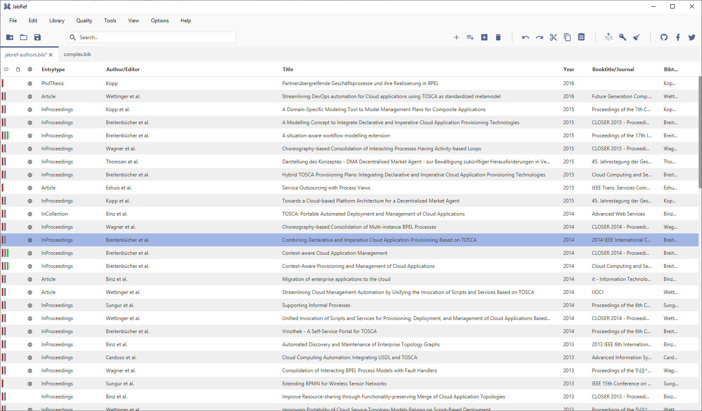

We are proud to announce the release the next milestone of JabRef. Today we are releasing Jabref 5.0.

## Notable Changes and New Features

JabRef now comes with support for high dpi monitors and offers a dark theme.
All in all, we reworked the user interface to increase usability.
For the programmers: This was enabled by completely switchting to [JavaFX](https://openjfx.io/) as UI technology.
This lays the foundation to support custom themes in future.

While we worked hard on creating a stable release, we also implemented a couple of new features:

- We reintroduced the [possibility to extract references from plain text](https://docs.jabref.org/import-export/import/newentryfromplaintext) (using [GROBID](https://github.com/kermitt2/grobid)). 
- We improved the display of group memberships by adding [multiple colored bars](https://docs.jabref.org/finding-sorting-and-cleaning-entries/groups#icon-and-color) if the entry belongs to more than one group. #4574
- We added a new feature that allows to (automatically) [search for citations in LaTeX files](https://docs.jabref.org/import-export/other-integrations/latex-citations).
In addtion, we added the LaTeX-Citations tab to the entry editor which quickly allows to show all files in which the current entries.
- We reworked the [JabRef-Browser integration plugin](https://github.com/JabRef/JabRef-Browser-Extension) (JabFox) which in addtion to Firefox now also works for Chromium based browsers 
- We added a new fetcher for ADS ([SAO/NASA Astrophysics Data System](https://docs.jabref.org/finding-sorting-and-cleaning-entries/import-using-online-bibliographic-database/ads)) and also changed all fetchers to use secure HTTPS instead of HTTP.
- We optimized the performance for working with a [shared SQL database](https://docs.jabref.org/collaborative-work/sqldatabase).
- We did tons of bugfixes. For more details check out our [Changelog](https://github.com/JabRef/jabref/blob/master/CHANGELOG.md)

## Installation

With the release of the 5.0 we switched to a new native Java build system [jpackage](https://jdk.java.net/jpackage/) which allows us to bundle a custom Java runtime together with JabRef.
This means that problems with other installed or outdated java versions on the system are a problem of the past.
For the installation we now offer self-containing `.deb` and `.rpm` files for Linux users and in addtion to the usual installer for Windows.
We also offer a portable zip version of JabRef which also includes all necessary files to run JabRef.
No installed Java version required.

**You can get it from [FOSShub](https://www.fosshub.com/JabRef.html).**

Please report any other issues that you encounter in our [bug tracker](https://github.com/JabRef/jabref/issues) (in case it was not already reported before).

## Breaking Changes

Since Jabref 5.0 is a major release, you should be aware that not all features are fully compatible with older version of JabRef. We worked hard to migrate all existing features to JabRef 5.0. The only currently known issue is the "global search": [The search bar doesn't remember the search string accross all tabs](https://github.com/JabRef/jabref/issues/4096). We also have some [performance issues with large databases](https://github.com/JabRef/jabref/issues/5071), but are working on it.

Remember that JabRef 4.0 changed the groups format. See <http://blog.jabref.org/#october-04-2017-%E2%80%93-jabref-4-0> for details.

## Special Thanks

The core [JabRef Developers](https://github.com/JabRef/jabref/blob/master/DEVELOPERS) would like to give special thanks to all new and old contributors. Since 4.0 we are very happy to see so many new contributors opening pull requests and making translations.
Special thanks goes to two temporary contributors who have significantly contributed to this release. You rock!

* **Martin Simon**, who wrote his Master's Thesis about the usability of JabRef and gave us valuable advice how to improve it. [[full paper](http://ceur-ws.org/Vol-2339/paper10.pdf)]
* **David Méndez**, who was our Google Summer of Code Student in 2019 and developed the [search for citations in LaTeX files](https://docs.jabref.org/import-export/other-integrations/latex-citations).

We also want to thank all universities including JabRef in their academic teaching. Hope to see more from that.

Finally, we  want to thank all the users who are constantly testing the latest snapshots and giving feedback!
