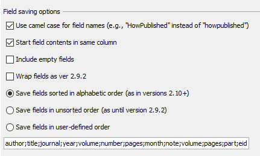
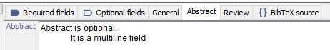
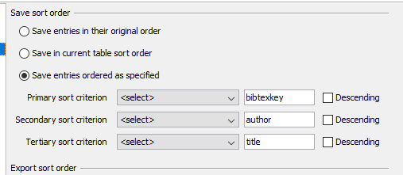
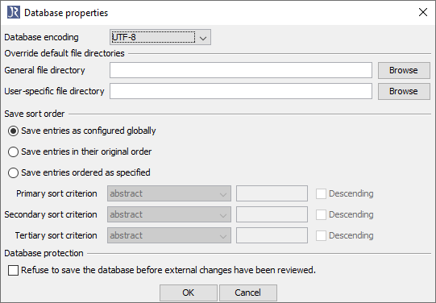

JabRef changed the writing of a BibTeX file over time.
This blog article aims presenting the different BibTeX contents for different JabRef versions.
The semantics of the content was never changed, but the "layout" in the file.
That lead to huge complaints over the time.
Especially, when a group used different JabRef versions.

The JabRef team decided in 2015 that this side effect is not acceptable and that only the parts of the bibliopgrahy touch by JabRef should be rewritten.
This was implemented in JabRef 3.1, released on 2015-12-24.

The discussions on a "useful" serialization of BibTeX entries continues.
This blog post lists the evolution of JabRef's chosen serialzation over time.
The aim is to i) make the changes over time transparent and ii) to support discussions on a "useful" serialization format.

The example used can be found in [bibtex-file-changes-over-time-demo.bib](../bib/bibtex-file-changes-over-time-demo.bib).

We illustrate the different serialiaztions using the following artificial entry:

```bibtex
@PhdThesis{6,
  Title = {Title is required},
  Author = {Field, Required},
  Abstract = {Abstract is optional.
              It is a multiline field},
  AbsolutelyCustom = {AbsolutelyCustom is a custom field}
}
```

The BibTeX entry type "Phd Thesis" consits of required and optional fields.
Additionally, fields not defined by BibTeX can be added to.
We call these fields "custom fields".

Please note that there is not really a "BibTeX standard".
Each BibTeX bibliography style file (`.bst`) defines the fields it displays in the bibliography on its own.
As a consequence, some some papers the `url` field is shown, in some it is not even though it is defined in the `.bib` file.

## History

### JabRef 2.0 to JabRef 2.9.2

- Types are in upper case letters: `@ARTICLE`
- Keys in lower case letters: `author`
- First the required fields, then the optional fields (each group sorted alphabetically)
- No alignment key/value separators (`=`)
- Multiline-content of a field start with a tab.
  Multiline content is reformatted as paragraphs have to be separated by an empty line (similar to LaTeX and Markdown).

```bibtex
@PHDTHESIS{5,
  title = {Title is required},
  absolutelycustom = {AbsolutelyCustom is a custom field},
  abstract = {Abstract is optional. It is a multiline field},
}

@ARTICLE{smith1980,
  author = {John Smith},
  title = {How I Weave Baskets Underwater},
  journal = {Journal of Underwater Basket Weaving and Nonsensical Latin Placeholder
	Texts},
  year = {1980},
  abstract = {Lorem ipsum dolor sit amet, consectetur adipiscing elit, sed do eiusmod
	tempor incididunt ut labore et dolore magna aliqua. Ut enim ad minim
	veniam, quis nostrud exercitation ullamco laboris nisi ut aliquip
	ex ea commodo consequat. Duis aute irure dolor in reprehenderit
	in voluptate velit esse cillum dolore eu fugiat nulla pariatur.
	Excepteur sint occaecat cupidatat non proident, sunt in culpa qui
	officia deserunt mollit anim id est laborum.},
}
```

### JabRef 2.10

- Types in camel case: `@InProceedings`
- Keys in camel case: `Year`, `Url` - optionally in lower case
- (optional) Alignment of key/value separators (`=`)
- Separation of required and optional field with an empty line
- First the `title` of a paper, then other required fields, then the optional fields
- Multiline-content of a field starts with a tab
- Newlines are kept in the field content (and are not interpreted as LaTeX or Markdown does)
- Leading spaces are trimmed

See also <https://github.com/JabRef/jabref/issues/116>

```bibtex
@PhdThesis{6,
  Title                    = {Title is required},

  Absolutelycustom         = {AbsolutelyCustom is a custom field},
  Abstract                 = {Abstract is optional.
 It is a multiline field}
}

@Article{smith1980,
  Title                    = {How I Weave Baskets Underwater},
  Author                   = {John Smith},
  Journal                  = {Journal of Underwater Basket Weaving and Nonsensical
 Latin Placeholder Texts},
  Year                     = {1980},

  Abstract                 = {Lorem ipsum dolor sit amet, consectetur adipiscing
 elit, sed do eiusmod tempor incididunt ut labore et
 dolore magna aliqua. Ut enim ad minim veniam, quis
 nostrud exercitation ullamco laboris nisi ut aliquip
 ex ea commodo consequat. Duis aute irure dolor in
 reprehenderit in voluptate velit esse cillum dolore
 eu fugiat nulla pariatur. Excepteur sint occaecat
 cupidatat non proident, sunt in culpa qui officia
 deserunt mollit anim id est laborum.}
}
```

The header included an advertisement on "JabRef":

```latex
% This file was created with JabRef 2.10.
% Encoding: Cp1252
```

### JabRef 2.11

This version was released on 2015-11-16 and introduced configuration options for saving the fields:



Field groups are not separated by an empty line any more:

```bibtex
@PhdThesis{6,
  Title                    = {Title is required},
  Absolutelycustom         = {AbsolutelyCustom is a custom field},
  Abstract                 = {Abstract is optional.
 It is a multiline field}
}
```

### JabRef 3.0

No more advertisement in the header any more: JabRef shows the "Encoding" information only:

```latex
% Encoding: UTF-8
```

The content of multiline fields is not indented any more.
When reading a pre-3.0 file, leading spaces are shown as is.



This is the result of a long internal discussion.
The main reason was that JabRef cnanot properly distinguish whether the indent of a file is intend or whether the indent originated from a pre-3.0 file.
Implementing heuristics (e.g., all lines are starting with the same amount of space characters) was neglected,
because such code needs to maintained and the team wants to focus to improve maintainability of JabRef:
Fix bugs and implement new features in a maintainable way.

### JabRef 3.1

JabRef 3.1 was released on 2015-12-24.
Up to JabRef 3.0, the whole bibliography file was rewritten, which lead to huge discussions at users.
This version wrote the entries as they were in case the user did not change any content.
In the case of a change, JabRef's own style was used.
Nevertheless, the sort order of the file could lead to a rewrite of the file, so users had to ensure proper configuration



To ease collaboration with others, JabRef introcuded to store the save order config locally in a BibTeX database:



JabRef changed the alignment of `=` signs.
They are are now directly followed after the key.
The values are still aligned (all `{` of one entry are put above each other)

Keys are written lowercase again, requried fields before optional ones.
Alphabetically, even `title` is sorted in alphabetically.

```bibtex
@PhdThesis{1,
  author =    {a},
  title =     {t},
  school =    {s},
  year =      {2015},
  abstract =  {a},
  directory = {d}
}
```

### JabRef 3.3 to 3.5

JabRef 3.3 was released at 2016-04-17.
The equal sign at keys is aligned with the content again:

```bibtex
@PhdThesis{1,
  author    = {a},
  title     = {t},
  year      = {2015},
  abstract  = {a},
  directory = {d},
  school    = {s},
}
```

As default, there is no file sorting any more.
This means, in a non-configured JabRef, the order of the entries in the file does not change when saving the file ("Save entries in their original order").

One can still configure the sort ordering of a specific database.

### JabRef 3.6 to 5.0

JabRef 3.6 was released on 2016-08-26.
In this version, comments are now preserved.
For instance, `% Comment` is kept in the `.bib` file:

```bibtex
% Comment

@Article{smith1980,
  author =       {John Smith},
  title =        {How I Weave Baskets Underwater},
  journal =      {Journal of Underwater Basket Weaving and Nonsensical
                  Latin Placeholder Texts},
  year =         1980,
  abstract =     {Lorem ipsum dolor sit amet, consectetur adipiscing
                  elit, sed do eiusmod tempor incididunt ut labore et
                  dolore magna aliqua. Ut enim ad minim veniam, quis
                  nostrud exercitation ullamco laboris nisi ut aliquip
                  ex ea commodo consequat.  Duis aute irure dolor in
                  reprehenderit in voluptate velit esse cillum dolore
                  eu fugiat nulla pariatur. Excepteur sint occaecat
                  cupidatat non proident, sunt in culpa qui officia
                  deserunt mollit anim id est laborum.},
}
```

The functionality was introduced in [#391](https://github.com/JabRef/jabref/pull/391).

## Links

- Discussion on the seralization format: <https://github.com/JabRef/jabref/issues/116>
- Discussion on blank lines: <https://github.com/JabRef/jabref/issues/115>
- Discussion on storing the serialization settings within the BibTeX file: <https://github.com/JabRef/jabref/issues/180>
- PR on sorting entries on save: <https://github.com/JabRef/jabref/pull/1054>
- Issue on wrapping fields: <https://github.com/JabRef/jabref/issues/114>
