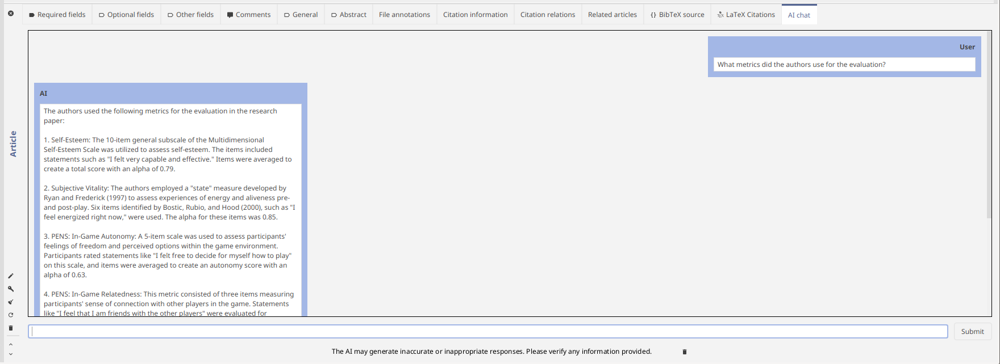
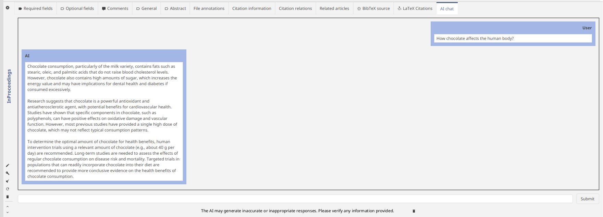
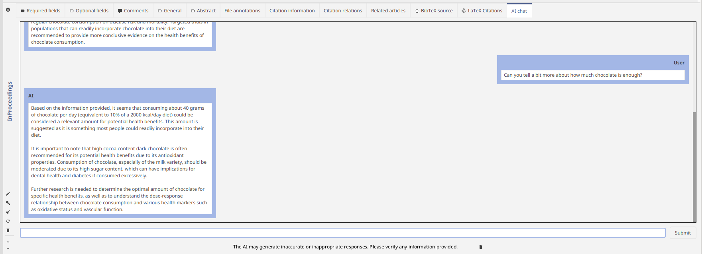
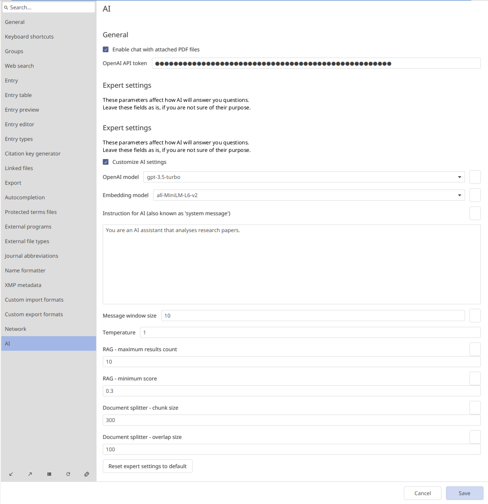

Hello, everyone! My name is Ruslan and I'm a novice JabRef contributor and I'm working on AI project for [Google Summer of Code](https://summerofcode.withgoogle.com/).

I want to introduce you to the new AI features in JabRef. Now, while you managing you research library, you can also chat with papers with a smart AI assistant. We use OpenAI API to achieve that.

## AI chat tab

We have made a new entry editor tab: "AI chat", where all the chatting happens.

In this window you can see those elements:

- Chat history with your messages
- Prompt for sending messages
- A button for clearing the chat history (just in case)

Let's try it out on a paper "Cooper, K., Donovan, J., Waterhouse, A., & Williamson, G. (2007). Cocoa and health: a decade of research. *British Journal of Nutrition*, 99(1), 1–11. doi:[10.1017/s0007114507795296](https://doi.org/10.1017/s0007114507795296)"

Let's ask about the chocolate.

Correct! The authors talk a lot about chocolate components, and how it can be a powerfull antioxidant.

It seems the AI mentioned the amount of chocolate a human should eat. Let's dive in this topic.

*Only 40 grams?* Well, health is our wealth. And AI helped us to uncover this information fast!

## How does this work?

In background JabRef analyses the linked PDF files of library entries. The information used after the indexing is then supplied to AI.

To generate AI output we used OpenAI's ChatGPT. And in order to use it you need to configure JabRef to use your OpenAI API key.

## How to get an OpenAI API key?

Unfortunately you need to pay OpenAI minimum 5$ for using ChatGPT via API. We will describe all the necessary steps in this step. 

To get OpenAI API key you need to perform these steps:

1. Login or create account [there](https://platform.openai.com/login?launch)
2. Go to "API" section
3. Go to "Dashboard" (upper-right corner)
4. Go to "API keys" (left menu)
5. Click "Create new secret key"
6. Click "Create secret key"
7. OpenAI will show you the key. Do not share it with anyone. 
    
Now you need to copy and paste it in JabRef preferences. To do this:

1. Launch JabRef
2. Go "File" -> "Preferences" -> "AI" (a new tab!)
3. Check "Enable chatting with PDFs"
3. Paste the key into "OpenAI token"
9. Click "Save"
    
If you have some money on your credit balance, you can chat with your library!

In order to increase credit balance on OpenAI, do this:

1. Add payment method [there](https://platform.openai.com/settings/organization/billing/payment-methods).
2. Add credit balance on [this](https://platform.openai.com/settings/organization/billing/overview) page.

## AI preferences

Here are some news options in JabRef preferences. 

- "Enable chatting with PDFs": by default chatting is turned off, so you need to check this option, if you want to use the new AI features
- "OpenAI token": here you page your API token
- "Expert settings": here you can change the parameters that affect how AI will generate your answers. If you don't understand the meaning of those settings, don't worry! We have experimented a lot and found the best parameters for you! 

## End

Thank you for using JabRef and checking out the AI functionality!

This is a only in one step of the Google Summer of Code project, so stay tuned for new AI features!

Currently the chatting is under development, so some bugs may occurr.

We value your opinion and we want to know: what AI features would you like to see in JabRef in future? What LLM providers (Azure, Google, etc.) you would like to have in next versions?
