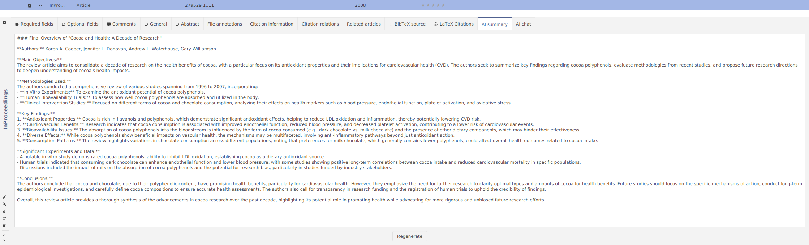
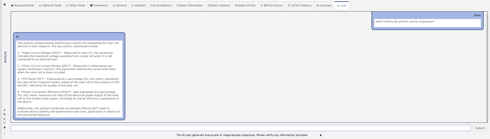

Hello, everyone! My name is Ruslan and I'm a novice JabRef contributor and I'm working on AI project for [Google Summer of Code](https://summerofcode.withgoogle.com/).

I want to introduce you to the new AI features in JabRef.

- AI can generate for you a summary of a research paper
- You can also chat with papers using a smart AI assistant

## AI summary tab

We have made a new entry editor tab: "AI Summary", where AI will generate for you a quick overview of the paper.

The AI will mention for you main objectives of the research, methods used, key findings, and conclusions.

## AI chat tab

The next new entry editor tab is "AI chat", where all the question and answering (Q&A) happens.

In this window you can see the following elements:

- Chat history with your messages
- Prompt for sending messages
- A button for clearing the chat history (just in case)

Let's try it out on a paper "Cooper, K., Donovan, J., Waterhouse, A., & Williamson, G. (2007). Cocoa and health: a decade of research. *British Journal of Nutrition*, 99(1), 1–11. doi:[10.1017/s0007114507795296](https://doi.org/10.1017/s0007114507795296)"

Let's ask about the chocolate.

Correct! The authors talk a lot about chocolate components, and how it can be a powerfull antioxidant.
Wow! AI has given so much infromation, and it's true: chocolate really contains polyphenols and fatty acids.

I was wondering, how much chocolate should a human eat in a day? Let's dive in this topic.

*Only 40 grams?* Well, our health is our wealth. And AI helped us to uncover this information!

## How does this work?

In the background, JabRef analyses the linked PDF files of library entries. The information used after the indexing is then supplied to the AI, which, to be precise, in our case is a Large Language Model (LLM).
The LLM is currently not stored on your computer. Instead, we have many integrations with AI providers (OpenAI, Mistral AI, Hugging Face), so you can choose the one you like the most.
We send chunks of text to AI service and then receive processed responses. In order to use it you need to configure JabRef to use your API key.

## Which AI provider should I use?

For now, we recomend you chosing [OpenAI](https://platform.openai.com/docs/models).

For Mistral AI you might need to make a subscription, while for OpenAI you can send money one time.

Hugging Face gives you access to numerous count of models for free.
However, it will take a very long time for Hugging Face to find a free computer resources for you, and the response time will be also long.

In order to use any service, you always need an API key.
Please head to the [AI user documentation](https://docs.jabref.org/ai/ai-providers-and-api-keys) to learn about how to receive a key and where to enter it in the preferences.

## AI preferences

Here are some new options in the JabRef preferences.

- "Enable AI functionality in JabRef": by default it is turned off, so you need to check this option, if you want to use the new AI features
- "AI provider": you can choose either OpenAI, Mistral AI, or Hugging Face
- "Chat model": choose the model you like (for OpenAI we recommend `gpt-4o-mini`, as to date, it is the cheapest and fastest, although we also recommend to look up the prices from time to time, as they are subject to change)
- "API token": here you write your API token
- "Expert settings": here you can change the parameters that affect how AI will generate your answers. If you don't understand the meaning of those settings, don't worry! We have experimented a lot and found the best parameters for you! But if you are curious, then you can refer to [user documentation]()

## BONUS

Have you ever wanted to try running a local LLM model on your computer with 100% privacy saved? We got you.

We wrote a tutorial of how to install and use `ollama` and integrate it in JabRef.

You find more information at the [user documentation](https://docs.jabref.org/ai/local-llm).

## Are you curious?

Try the AI features in our current development version and play around with the new feature 

Thank you for using JabRef and checking out the AI functionality!

We value your opinion and we want to know: What AI features would you like to see in JabRef in future? What LLMs or other integrations would you like to have in next versions?

Please show up in our [Feedback forum](https://discourse.jabref.org/c/feedback/3).
