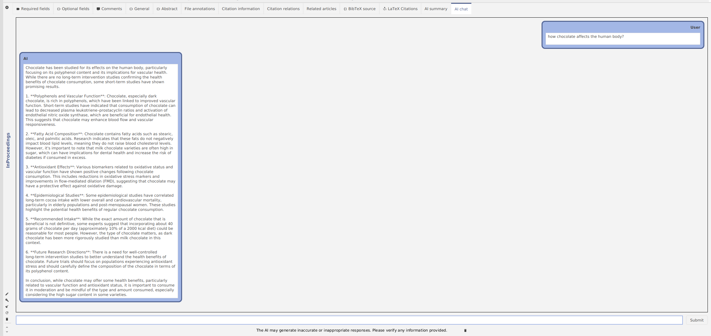
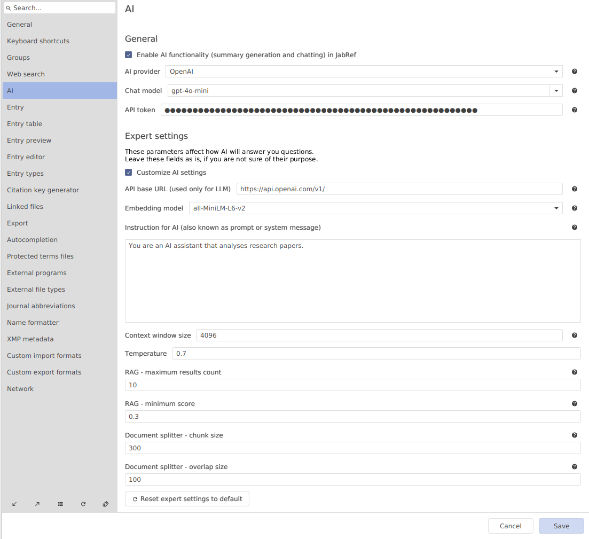

My name is Ruslan. I’m a novice contributor to JabRef, currently working on an AI project for [Google Summer of Code](https://summerofcode.withgoogle.com/).

I am thrilled to present the cutting-edge AI capabilities now integrated into JabRef, namely the "AI Summary" and the "AI Chat" features. These Innovations are designed to revolutionize your research experience!

In short:

- **AI Summary**: With this feature, you can generate a summary of a research paper
- **AI Chat**: This feature allows you to chat with your scientific papers

## AI Summary

I have introduced a new entry editor tab named "AI Summary". Here, you can use the AI to generate a quick overview of the scientific paper.

The AI highlights the main objectives of the research, the methods used, the key findings and the conclusions.

## AI Chat

The next new entry editor tab is "AI Chat," where all the questions and answers (Q&A) happen.

In the window below, you can see the following elements:

- The chat history with your messages
- A button called "submit" that allows you to send a message (also commonly called "prompting")
- A button for clearing the chat history

Let's try it out with the following paper: "Cooper, K., Donovan, J., Waterhouse, A., & Williamson, G. (2007). Cocoa and health: a decade of research. *British Journal of Nutrition*, 99(1), 1–11. doi:[10.1017/s0007114507795296](https://doi.org/10.1017/s0007114507795296)"

Let's ask about the chocoloate.

Correct! The authors discuss chocolate components extensively and how it can be a powerful antioxidant.

I was wondering, how much chocolate should a human eat? Let's ask it.

*Only 40 grams?* Well, our health is our wealth. And AI helped us to uncover this information!

## How does this work?

JabRef mainly makes use of Large Language Models (LLMs).

Let's break down the dataflow:

* **Create Embeddings:** First of all, JabRef uses a smaller "embedding model" locally on your computer. This model converts the extracted chunks of text from PDFs into numerical representations called embeddings. Embeddings capture the meaning and relationships between words in a way that Large Language Models can understand.
* **Sending Data to the API:**  JabRef then sends these embeddings (along with any other relevant context, such as the chat history) to an API. Think of an API as a set of rules and instructions that allow different software applications to talk to each other. If you choose an external AI service provider, such as OpenAI, Mistral or Hugging Face, the data will leave your computer. If you choose an OpenAI API compatible application that purely operates on your local computer, it is possible to store the LLM on your computer and process the data there, but some of them also allow you to make use of remote model hosting. In all cases, be it a separate application or a remote AI service provider, their particular privacy policy will apply.
* **Processing by the LLM:** The chosen AI service provider or the separate application will process the embeddings via a LLM (or a similar technology) and send a response back to JabRef, which is then displayed in the UI.

## Which AI provider should I use?

> [!Note]
> To use any of the providers, it is required to configure an API key in JabRef's preferences.

We have many integrations with AI providers, so you can choose the one you like the most 😊 

There are various considerations, such as pricing, capabilities, speed, privacy policy and more (that may change at any time) to take into account that make it difficult to give a clear recommendation that will stand the test of time. I strongly recommend to look up the models pricing before you choose. Smaller models will be cheaper and faster than larger models, whereas larger models tend to outperform in terms of capabilities. In any case, here is the list of providers:

[OpenAI](https://platform.openai.com/docs/models).
[MistralAI](https://docs.mistral.ai/getting-started/models/)
[Huggingface](https://huggingface.co/models?pipeline_tag=text-generation&sort=trending)

While OpenAI deserved a spot because of its popularity, Mistral's models are high up there in the benchmarks too and they led the way in terms of releasing [open weight](https://github.com/Open-Weights/Definition) models with Apache 2.0 licenses, which should warm the heart of anybody favouring Open Source. Hugging Face is currently a little bit special, as they give you access to thousands of open weight models [for free](https://huggingface.co/docs/api-inference/index), including ones with commercially friendly licenses (Apache 2.0, MIT), however, it may take a long time for Hugging Face to allocate free computing resources, resulting in longer response times, unless you choose (and pay) for a [GPU space](https://huggingface.co/docs/hub/spaces-gpus) that is much faster at inference.

Finally, iF you are asking yourself, where can I find an API key and what is it even? Please head to the [AI user documentation](https://docs.jabref.org/ai/ai-providers-and-api-keys) to learn about how to receive a key and where to enter it in the preferences.

## AI preferences

Yes, by the way, there are some new options in the JabRef preferences, such as

- "Enable AI functionality in JabRef": by default it is turned off, so you need to check this option if you want to use the new AI features
- "AI provider": you can choose either OpenAI, Mistral AI, or Hugging Face
- "Chat model": choose the model you like
- "API token": here you write your API token
- "Expert settings": the defaults provide good results. In case you would like to modify them, our [user documentation](https://docs.jabref.org/ai) provides an explanation of it

## BONUS

Have you ever considered running a local LLM on your computer while ensuring complete privacy?

I wrote a tutorial of how to install and use `ollama` and integrate it in JabRef.

You find more information at the [user documentation](https://docs.jabref.org/ai/local-llm).

## Are you curious?

Try the AI features in our current development version and explore the new functionality.

Thank you for using JabRef and checking out the AI functionality!

We value your opinion and want to know: What AI features would you like to see in JabRef in the future? What LLMs or other integrations would you like in upcoming versions?

Please show up in our [Feedback forum](https://discourse.jabref.org/c/feedback/3).
