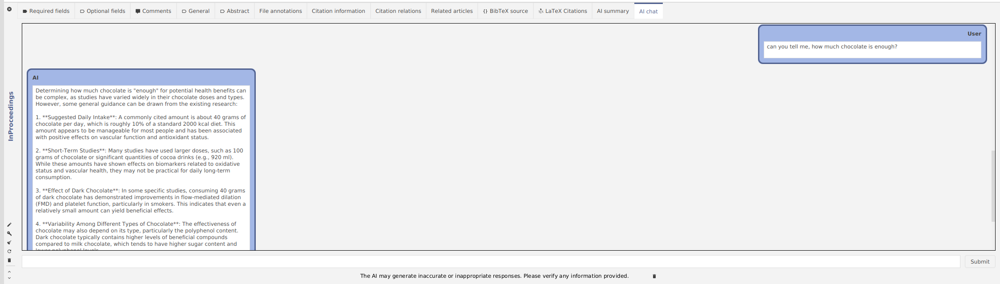

My name is Ruslan. I’m a novice contributor to JabRef, currently working on an AI project for [Google Summer of Code](https://summerofcode.withgoogle.com/).

I want to introduce you to the new AI features in JabRef.

- AI can generate for you a summary of a research paper
- You can also chat with papers using a smart AI assistant

## AI summary tab

We have introduced a new entry editor tab, "AI Summary," where AI generates a quick overview of the paper for you.

The AI highlights the main objectives of the research, methods used, key findings, and conclusions for you

## AI chat tab

The next new entry editor tab is "AI Chat," where all the questions and answers (Q&A) happen.

In this window, you can see the following elements:

- Chat history with your messages
- Prompt for sending messages
- A button for clearing the chat history (just in case)

Let's try it out on a paper "Cooper, K., Donovan, J., Waterhouse, A., & Williamson, G. (2007). Cocoa and health: a decade of research. *British Journal of Nutrition*, 99(1), 1–11. doi:[10.1017/s0007114507795296](https://doi.org/10.1017/s0007114507795296)"

Let's ask about the chocolate.

Correct! The authors discuss chocolate components extensively and how it can be a powerful antioxidant.

I was wondering, how much chocolate should a human eat in a day? Let's dive in this topic.

*Only 40 grams?* Well, our health is our wealth. And AI helped us to uncover this information!

## How does this work?

In the background, JabRef analyses the linked PDF files of library entries. After indexing, this information is supplied to the AI, which, in our case, is a Large Language Model (LLM).
The LLM is currently not stored on your computer. Instead, we have many integrations with AI providers (OpenAI, Mistral AI, Hugging Face), so you can choose the one you like the most.
We send chunks of text to AI service and then receive processed responses. To use it, you need to configure JabRef with your API key.

## Which AI provider should I use?

For now, we recommend you choosing [OpenAI](https://platform.openai.com/docs/models).

For Mistral AI, you might need to make a subscription, whereas for OpenAI, a one-time payment option is available

Hugging Face gives you access to numerous count of models for free.
However, it may take a long time for Hugging Face to allocate free computing resources, resulting in longer response times

In order to use any service, you always need an API key.
Please head to the [AI user documentation](https://docs.jabref.org/ai/ai-providers-and-api-keys) to learn about how to receive a key and where to enter it in the preferences.

## AI preferences

Here are some new options in the JabRef preferences.

- "Enable AI functionality in JabRef": by default it is turned off, so you need to check this option if you want to use the new AI features
- "AI provider": you can choose either OpenAI, Mistral AI, or Hugging Face
- "Chat model": choose the model you like (for OpenAI we recommend `gpt-4o-mini`, as to date, it is the cheapest and fastest, though we also recommend to look up the prices periodically, as they are subject to change)
- "API token": here you write your API token
- "Expert settings": the defaults provide good results. In case you would like to modify them, our [user documentation](https://docs.jabref.org/ai) provides an explanation of it

## BONUS

Have you ever considered running a local LLM on your computer while ensuring complete privacy?

We wrote a tutorial of how to install and use `ollama` and integrate it in JabRef.

You find more information at the [user documentation](https://docs.jabref.org/ai/local-llm).

## Are you curious?

Try the AI features in our current development version and explore the new functionality.

Thank you for using JabRef and checking out the AI functionality!

We value your opinion and want to know: What AI features would you like to see in JabRef in the future? What LLMs or other integrations would you like in upcoming versions?

Please show up in our [Feedback forum](https://discourse.jabref.org/c/feedback/3).
