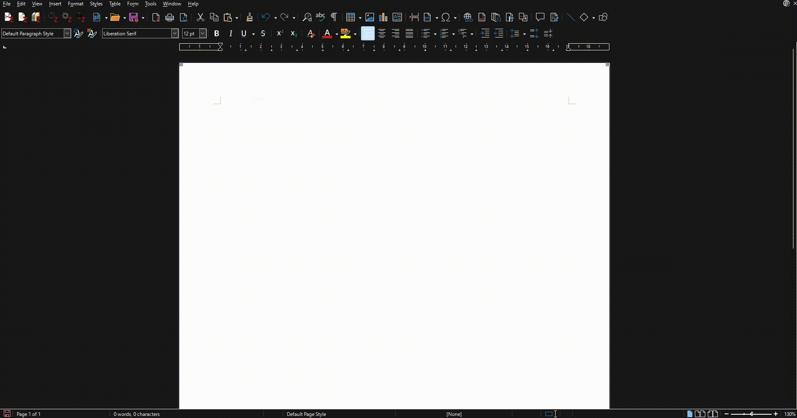
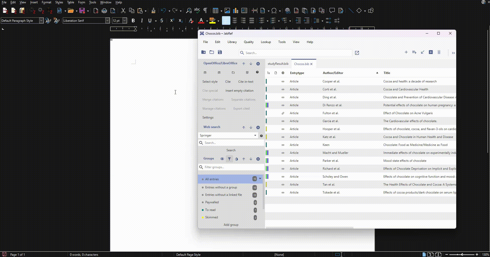
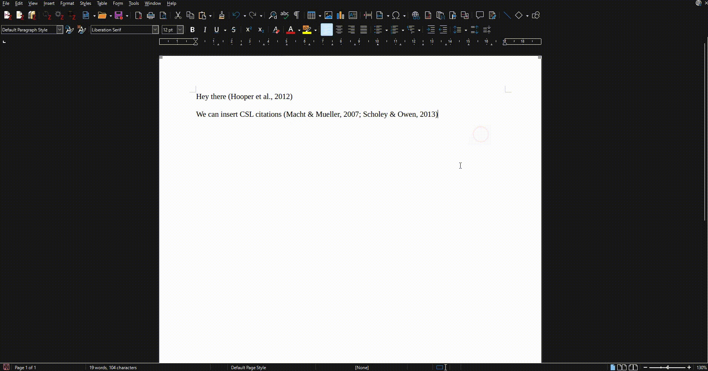
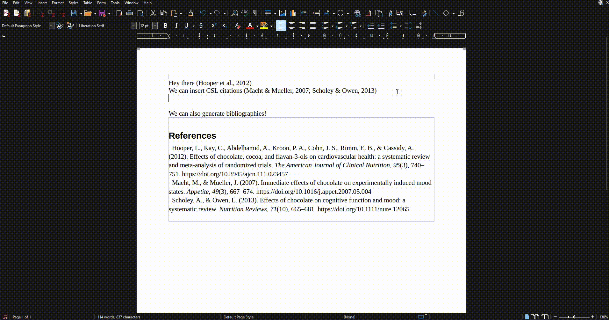

Hi, I am Subhramit. I am a Google Summer of Code (GSoC) student at JabRef this year, and I'll be walking you through JabRef's new CSL Integration for LibreOffice.

## Background

As a student, I first came across pre-defined citation formats during my freshman year of college, when our professor instructed that the references in our project report must follow the "APA style".  

I remember manually generating and copying citations in that style from a citation generation website, and oh was it tedious. Whether you are a student like me or a seasoned researcher in academia, you must have grappled with various citation styles throughout your academic journey.

[Citation Style Language](https://citationstyles.org/) (CSL) is a popular open-source specification language that standardizes the formatting of citations and bibliographies. It supports thousands of standard citation styles used in academia, including *American Psychological Association* (APA), *Modern Language Association* (MLA), *Chicago Manual of Style* (CMS), *Institute of Electrical and Electronics Engineers* (IEEE), *Springer - Lecture Notes in Computer Science* and *Vancouver* to name a few. If you've ever cited a source in an academic paper, chances are you've used a style that is supported by CSL.

For several years, JabRef users have been requesting support for CSL in JabRef's LibreOffice integration. Tackling this problem statement this summer as a part of my project, I am excited to announce that this highly anticipated feature is now available!

## What's New?

With this integration, JabRef users can now:

- **Choose a CSL Style**: Select from a vast collection of CSL styles to match the requirements of your academic work.
- **Cite with ease**: Insert citations directly into your LibreOffice document.
- **Auto-generate Bibliographies**: Watch as your bibliography automatically populates based on your citations, with just a single click.
- **Update Bibliographies**: Easily refresh your bibliography as you add new citations to your document.

## Getting Started

To start using this new feature:

1. Download the [development version of JabRef](https://builds.jabref.org/main/).
2. Connect to a running LibreOffice document instance by either clicking the "Connect" or the "Manual Connect" button in the [Libre/OpenOffice Panel](https://docs.jabref.org/cite/openofficeintegration) in the side pane.
3. Click on "Select style".
4. Choose your preferred CSL style from the list and click "OK".
5. Select an entry (or a group of entries) and click the "Cite" button to insert citations into the document.
6. Click the "Make/Sync bibliography" button to auto-generate a bibliography section in your document based on your citations and the selected CSL style.

### Demo

#### Selecting a style

#### Inserting citations

#### Generating bibliography

#### Updating bibliography

## Summary

This CSL integration is a direct result of working on valuable user feedback, addressing long-standing feature requests ([#119](https://github.com/JabRef/jabref/issues/119) and [#2146](https://github.com/JabRef/jabref/issues/2146) on our GitHub).

If you are interested in the technical details of how this project was undertaken, do check out the [wiki](https://github.com/JabRef/jabref/wiki/GSoC-2024-%E2%80%90-Improved-CSL-Support-%28and-more-LibreOffice%E2%80%90JabRef-integration-enhancements%29).

I hope this new feature enhances your research and writing process. As always, [feedback and suggestions for further improvements](https://discourse.jabref.org/c/feedback/3) are welcome.

Happy citing!
