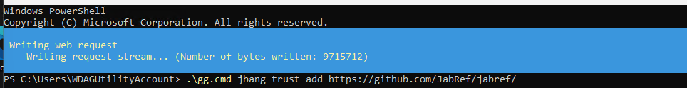
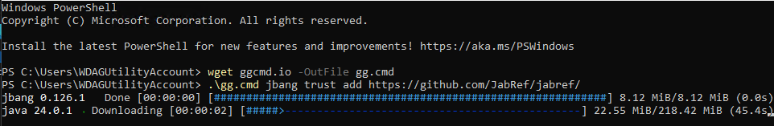
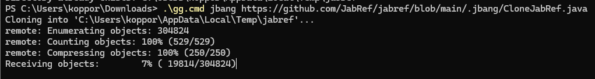

JabRef gets many contributions by external contributors in the form of [pull requests](https://github.com/jabref/jabref/pulls).
Curious how the feature or fix behaves?
You now can try out and give feedback easily.

For instance, to try out the "[initial implementation of walkthrough](https://github.com/JabRef/jabref/pull/13182)", one needs to execute following command:

```cmd
.\gg.cmd just run-pr 13182
```

As preparation, one needs to clone JabRef's source code and download [`gg.cmd`](https://github.com/eirikb/gg#ggcmd) and place it into the cloned source code directory.

The preparation is also simplified by `gg.cmd`.

1. [Download `gg.cmd`](https://github.com/eirikb/gg/releases/latest/download/gg.cmd)
2. Instruct `JBang` to trust JabRef: Execute `.\gg.cmd jbang trust add  https://github.com/JabRef/jabref/`.\
   \
   
3. Clone JabRef into a temporary folder. Execute `.\gg.cmd jbang https://github.com/JabRef/jabref/blob/main/.jbang/CloneJabRef.java`.\
   
4. After it finishes, it will output the directory:

   ```text
   JabRef code available at: C:\Users\koppor\AppData\Local\Temp\jabref
   ```

5. Go to the directory: `cd C:\Users\koppor\AppData\Local\Temp\jabref` (Note - replace "`koppor`" with your username).
6. Move `gg.cmd` to here: `move C:\Users\koppor\Downloads\gg.cmd .`. (Note - replace "`koppor`" with your username. The path also needs to be changed if you have downloaded `gg.cmd` anywhere else).
7. Now you can run a PR using `.\gg.cmd just run-pr 13182` (replace 13182 with the PR number of whichever PR you want to try out). Initially, this might take several minutes, as the build environment has to be initialized and JabRef is build completely from scratch. You will also need to tell JBang to trust JabRef's code. In later runs the run will be faster.

## Advanced Hints

For Linux and macOS, use `sh ./gg.cmd` instead of `.\gg.cmd`.

You can run other parts of JabRef using `gradle`. For instance for `JabKit`:

```cmd
.\gg.cmd gradle :jabkit:run --args="--help"
```

The content in `--args="..."` are the command line parameters for `JabKit`.

## Special Thanks

- [`gg.cmd`](https://github.com/eirikb/gg#ggcmd) for automatic downloading and execution of required tooling.
- [JBang](https://www.jbang.dev/) for enabling easy execution of `.java` files.

## More Information

More information is available in our [contributing guide](https://docs.jabref.org/contributing#i-would-like-to-try-out-a-feature-introduced-at-pull-request).
