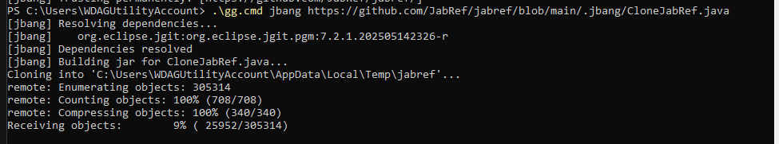

Thanks to the strong ecosystem of Java, one can easily try out (nearly) any JabRef pull request.
For instance, to try out the "[initial implementation of walkthrough](https://github.com/JabRef/jabref/pull/13182)", one needs to execute following command:

```cmd
.\gg.cmd just run-pr 13182
```

As preparation, one needs to clone JabRef's source code and download [`gg.cmd`](https://github.com/eirikb/gg) and place it into the cloned source code directory.

The preparation is also simplified by `gg.cmd`.

1. [Download `gg.cmd`](https://github.com/eirikb/gg/releases/latest/download/gg.cmd)
2. Execute `.\gg.cmd jbang https://github.com/JabRef/jabref/blob/main/.jbang/CloneJabRef.java`. This will clone JabRef into a temporary folder.

    1. Initialization\
       
    2. JBang will ask for trust - please trust the script with <kbd>2</kbd> and then <kbd>Enter</kbd>\
       
    3. Clone happens\
       

3. After it finishes, it will output the directory:

   ```text
   JabRef code available at: C:\Users\koppor\AppData\Local\Temp\jabref
   ```

4. Go to the directory: `cd C:\Users\koppor\AppData\Local\Temp\jabref` (Note - replace "`koppor`" with your username).
5. Move `gg.cmd` to here: `move C:\Users\koppor\Downloads\gg.cmd .`. (Note - replace "`koppor`" with your username. The path also needs to be changed if you have downloaded `gg.cmd` anywhere else).
6. Now you can run a PR using `.\gg.cmd just run-pr 13182` (replace 13182 with the PR number of whichever PR you want to try out). Initially, this might take several minutes, as the build environment has to be initialized and JabRef is build completely from scratch. You will also need to tell JBang to trust JabRef's code. In later runs the run will be faster.

## Troubleshooting

For Linux and macOS, use `sh ./gg.cmd` instead of `.\gg.cmd`.

You might get "error: No justfile found"

```monospace
just gui
error: No justfile found
error: Recipe `run-pr` failed on line 21 with exit code 1
Unable to execute
```

Then, the pull request has not merged recent `main`.
You need to "manually" start:

```cmd
.\gg.cmd gradle :jabgui:run
```

## More Information

More information is available in our [contributing guide](https://docs.jabref.org/contributing#i-would-like-to-try-out-a-feature-introduced-at-pull-request).
