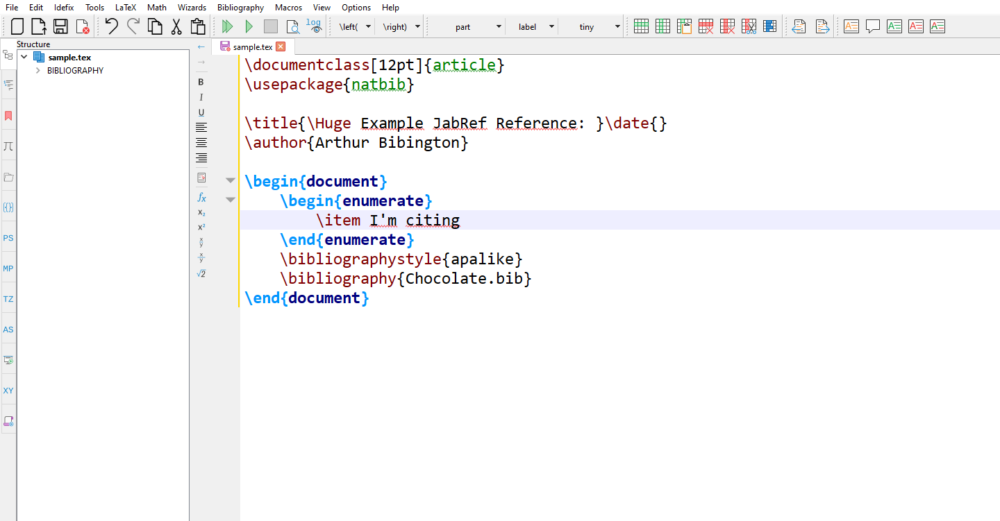

When working with LaTeX editors, it is often a struggle to switch between JabRef and the editor to search for the according entries and their citation keys.
This is especially true when working with large libraries, where the search can take a while.
To make this easier, JabRef now offers a Cite As You Write (CAYW) endpoint that allows you to search for entries and their citation keys directly from your LaTeX editor and automatically insert them at your current cursor position.

## Preparation

To use the CAYW endpoint, you need to have JabRef running and the HTTP server enabled.
To enable the HTTP server, go to `File` → `Preferences` → `General` and under `HTTP Server` section check the box for `Enable HTTP Server`.

## Using the CAYW endpoint

We are working on becoming fully compatible with the CAYW Endpoint of [Better BibTeX for Zotero](https://retorque.re/zotero-better-bibtex/citing/cayw/index.html).

For a whole list of parameters and other editors, see our [User Documentation](https://docs.jabref.org/cite/cite-as-you-write).

In this example, we will use [TeXstudio](https://www.texstudio.org/).

Open TeXstudio and go to `Macros` → `Edit Macros`, there you have to set a `Name` and a `Trigger` for the macro.
After that you have to set the Type to `Script` and paste the following code into the `Script` field:

```shell
var url = "http://localhost:23119/better-bibtex/cayw??format=biblatex&texstudio=true&minimize=true&command=cite"
system("curl -sS '" + url + "'")
```



After that, you can save the macro and close the dialog by clicking `Ok`.

Now you can use the macro by typing "aaa" and the search dialog opens up and you can then search for entries and select them.


## Are you curious?

Try the CAYW feature in our [current development version](https://builds.jabref.org/main/) and explore the new functionality.

Your opinion is highly appreciated: Please show up in our [Feedback forum](https://discourse.jabref.org/c/feedback/3).
