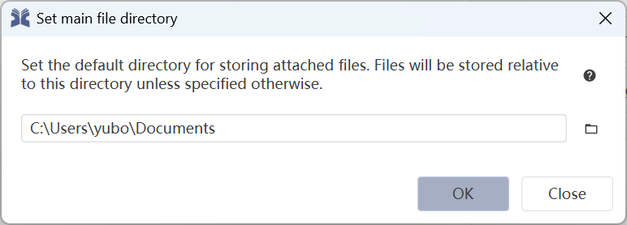

Hello! I'm [Yubo Cao](https://www.yubo-cao.com/), a [Google Summer of Code (GSoC) student at JabRef](https://summerofcode.withgoogle.com/myprojects/details/ae6W329p) this year. Today, I'm excited to share with you the new walkthrough and welcome tab features in JabRef that I worked on.

## Background

JabRef is a free, open-source reference manager that has been evolving since 2003. Over the years, our community has continuously added new features to help users manage their references more efficiently. However, some of these features can be challenging for new users to discover, and the default setting of certian features cannot be determined without prior knowledge about the user's intended usecase of JabRef. To address such challenges (e.g., [#12272](https://github.com/JabRef/jabref/issues/12272), [#12664](https://github.com/JabRef/jabref/issues/12664), and [#9491](https://github.com/JabRef/jabref/issues/9491)), walkthroughs and a refined welcome tab have been introduced to help new users get started with JabRef without needing to read through the entire documentation.

## What's New?

With these new features, JabRef users can now:

**Access Walkthroughs**: We've added walkthroughs to help new users get started with JabRef. These walkthroughs highlight the controls you need to interact with in a step-by-step manner, reducing the need to visit our [documentation](https://docs.jabref.org/) to get started with selected features. Currently, there are five walkthroughs, which are on:

1. Setting the main file directory
2. Customizing the entry table
3. Linking PDF/external files to entries (e.g. through the built-in full-text download, URL download, and directly by dragging-and-dropping the file)
4. Grouping entries in a library
5. Searching through the library using basic full-text search and advanced Lucene syntax

**Utilize the Enhanced Welcome Tab**: The new welcome tab is more feature-rich compared to the previous version.

- Quick settings in the welcome tab allow you to configure the most commonly-used settings with a single click. Those features are:
  - Set the [main file directory](https://docs.jabref.org/finding-sorting-and-cleaning-entries/filelinks):
    
    
  - Change JabRef's visual theme:
    
    
  - Optimize JabRef for large libraries:
    
    
  - Toggle whether citation key should be shown in the entry table:

    
  - Configure push to application:
    
    
  - Configure web search services (such as JabRef checking for updates, web search, Mr. DLib, Grobid and more:
    
    

- Walkthroughs can be directly opened from the welcome tab, making it easier for new users to get started with JabRef.

Additionally, the welcome tab now features a responsive layout that ensures proper display when you organize JabRef side-by-side with other applications.

If you're eager to try out these features, simply download the [latest development version](https://builds.jabref.org/main/) and open JabRef. You will be greeted with the new walkthrough and welcome tab upon opening the application.

## Summary

If you are interested in the technical details of how this project was undertaken, do check out the [wiki](https://github.com/JabRef/jabref/wiki/GSoC-2025-%E2%80%90-Walkthrough-and-Welcome-Tab).

I hope this new feature helps you get started with JabRef. As always, [feedback and suggestions for further improvements](https://discourse.jabref.org/c/feedback/3) are welcome.
