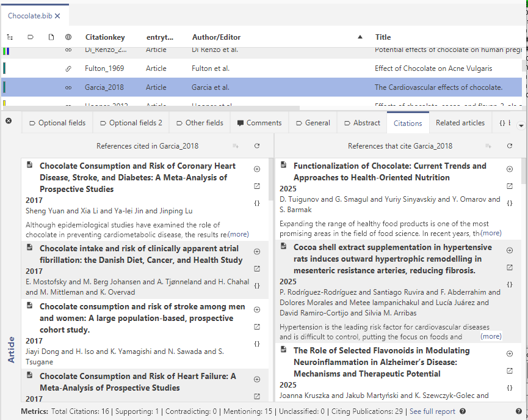

Trick or treat! Happy Halloween from the JabRef team!
We are happy to announce the release of **JabRef 6.0 Alpha 3**, the next step towards the stable version of JabRef 6.0.
This alpha release brings a huge number of bug fixes, improvements, and new features, as well as some changes under the hood in the machine room of JabRef, to make future improvements easier and JabRef more versatile.

As always, since this is an alpha release, we strongly recommend making a backup of your .bib files before updating.

## GSoC

Two of our contributors, [Wanling](https://github.com/wanling0000) and [Yubo](https://github.com/Yubo-Cao) have already finished their projects ([Git support](https://github.com/JabRef/jabref/wiki/GSoC-2025-%E2%80%90-Git-Support-for-JabRef) and [Welcome Walkthroughs/Welcome Tab](https://github.com/JabRef/jabref/wiki/GSoC-2025-%E2%80%90-Walkthrough-and-Welcome-Tab)).
[Philip](https://github.com/palukku) is already on the finishing line and you can already test the [Cite-As-You-Write](https://blog.jabref.org/2025/07/25/cayw-endpoint/) feature he introduced.
We are very proud to present their work in this release.

## Release Highlights

- Arm64 Linux support, we now distribute binaries for Linux ARM64 distributions
- Improved UI interface for Citations
- New Fetchers: Integration of OpenAlex and EuropePMC
- Initial Cite As You Write endpoint
- CSL styles can now also be found by their short name (e.g. "apa")
- Integrity check is now also available as part of the JabKit command-line tool
- Hanging indents in CSL styles are now supported in LibreOffice
- First CLI-only version of JabRef: `JabKit`. See [#JabKit](https://foojay.social/tags/JabKit) for some inspirations.

## Citations

We completely reworked the citation tab. It is now much more user-friendly and has a new look.

## CSL Styles and Libre Office integration

We now support CSL styles by their short name (e.g. apa), and we fixed some issues surrounding their usage in LibreOffice.

- Hanging indents for bibliographies are now rendered correctly in LibreOffice documents
- We fixed an issue where bibliography entries generated from CSL styles had leading spaces.
- We added "Bibliography Heading" to the available CSL bibliography header formats in the LibreOffice integration.
- A space is now added by default after citations inserted via LibreOffice/OpenOffice integration. This behvaior is configurable.

## Linked Files

- You can now automatically rename linked files when entry data changes through the new option in Preferences
- Added support for managing multiple linked files directly via the entry context menu.

### Web Search and Import

- Web search results now support pagination, improving navigation for large result sets.
- New ID-based fetcher for [EuropePMC](https://europepmc.org/).
- Added support for the OpenAlex fetcher.
- Medline/Pubmed fetcher can now be used with an API key.
- When importing an entry the group can now be also selected.

## Known Issues

This is an alpha release, and we are still actively working on multiple issues. Some of them may be a regression to the last stable minor release of the 5 major series. Use the alpha release for testing only and backup your libraries before and during use.

Be aware that currently the [update notification is broken](https://github.com/JabRef/jabref/issues/13000). It will inform you that a new version of JabRef is available, even though you have downloaded the latest release. Just ignore the notification.

## Feedback and Testing

If you'd like to try JabRef 6.0 Alpha 3, you can download it from [the release page on GitHub](https://github.com/JabRef/jabref/releases/tag/v6.0-alpha3).
We’re keen to hear your feedback! Please report bugs, suggestions, or feature requests on our [GitHub issue tracker](https://github.com/JabRef/jabref/issues) or join the discussion in our [discussion board](https://discourse.jabref.org/), in our [gitter-channel](https://gitter.im/JabRef/jabref) or on [Mastodon](https://foojay.social/@jabref).
Finally we want to thank again all donors of time and money for their generous donations which enable us to continue working on JabRef!

Thank you for testing JabRef 6.0 Alpha 3, and remember to make a backup of your libraries first! 💙

Thanks again to all the first time contributors at JabRef - 805 and increasing.

## Contributors

We thank following external contributors who contributed code to this JabRef release:
