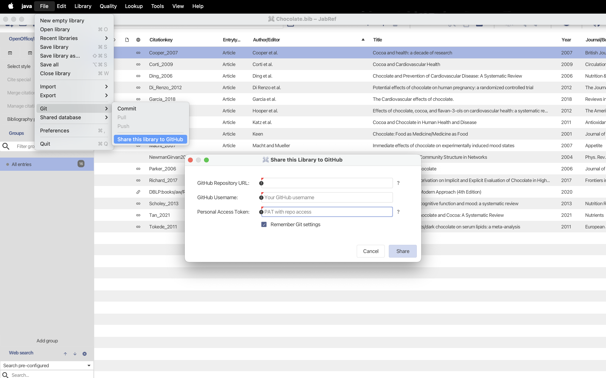
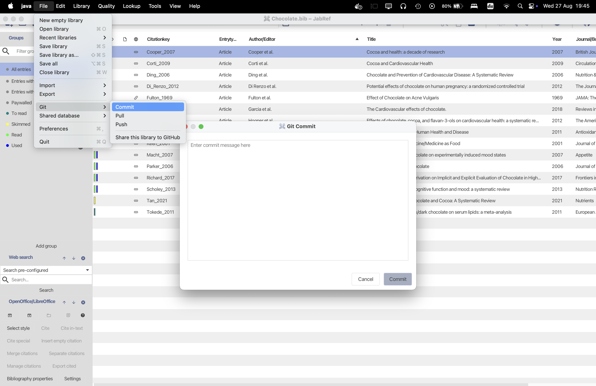
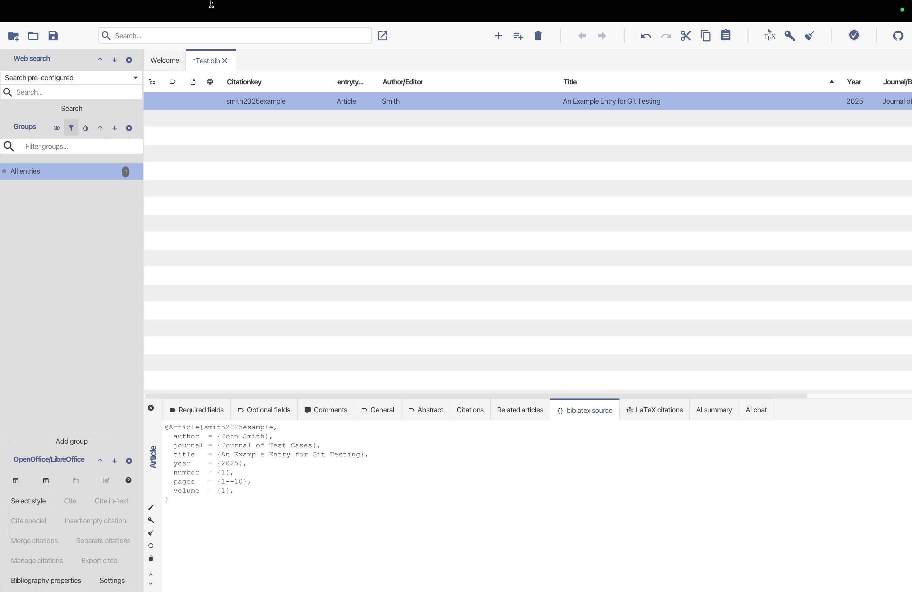
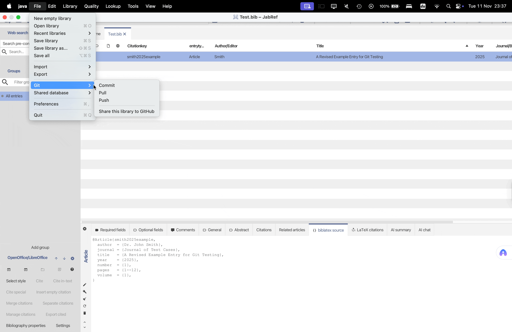
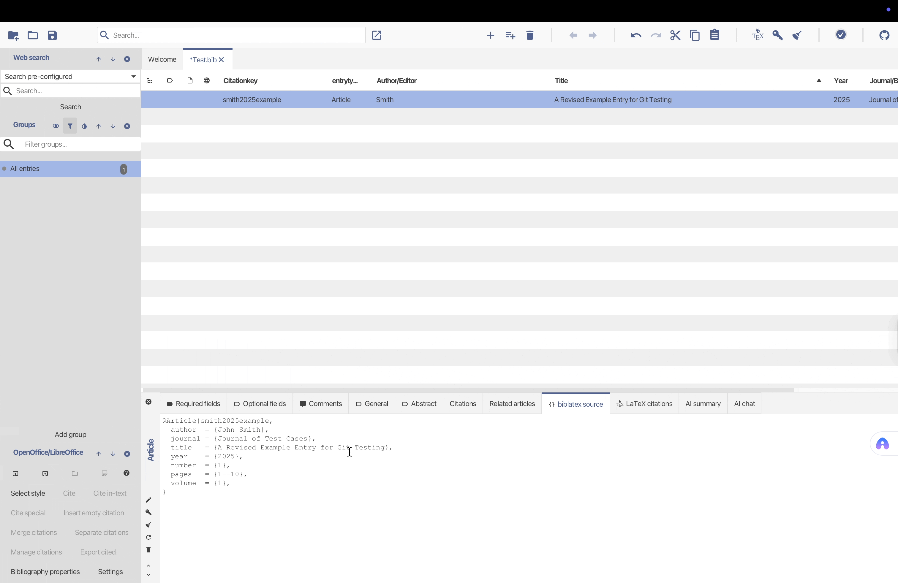

Hello! I’m Wanling, one of the [Google Summer of Code (GSoC)](https://summerofcode.withgoogle.com/programs/2025/projects/R9UcJNpJ) students contributing to JabRef this year. In this post, I’d like to introduce a small but helpful feature we recently added — experimental Git integration in JabRef.

## Background

JabRef is a popular open-source reference manager. As BibTeX libraries grow, users often face two problems ([issue #12350](https://github.com/JabRef/jabref/issues/12350)):

- **Version control:** Manually backing up different versions of a `.bib` file can be confusing and error-prone.
- **Collaboration:** When multiple people edit the same file, it’s hard to track changes or merge them properly.

## What’s New?

**1. Semantic three-way merge**

Traditional Git merges only look at text differences, which can easily misjudge changes in BibTeX files.  
This time, we implemented a BibTeX-specific **semantic three-way merge**.  
It not only detects which fields have conflicts but also shows a GUI to compare fields one by one and choose which side to keep.  
If no conflicts are found, JabRef will merge and commit automatically without interrupting your workflow.

**2. Basic Git operations**

- **Share to GitHub:** You only need to enter the GitHub repository URL and a Personal Access Token (PAT), and JabRef will automatically initialize the local repository, add the remote, and push the current `.bib` file.
  
- **Git Commit:** Write a message and commit the changes of the current `.bib` file.

- **Git Pull:** Pull the latest changes from the remote and perform semantic merge.
  -  *Without conflicts:*
     
  - *With conflicts:*
   
- **Git Push:** Push local commits to the remote if there are no conflicts and the file has been saved.
    

These operations are clearly presented in the JabRef menu. Even if you’ve never used Git before, you can use them easily.

## Are you curious?

You can try out this feature in our [current development version](https://builds.jabref.org/main/) and see how it works in practice.  
We’d love to hear what you think — feel free to share your feedback in our [feedback forum](https://discourse.jabref.org/c/feedback/3).

Bug reports and feature suggestions related to Git integration are tracked in a [separate issue tracker](https://github.com/wanling0000/jabref/issues).

This Git integration is still in an early stage, but we hope it already helps users manage version history and collaborate more easily on `.bib` files.  
Further improvements are planned.
