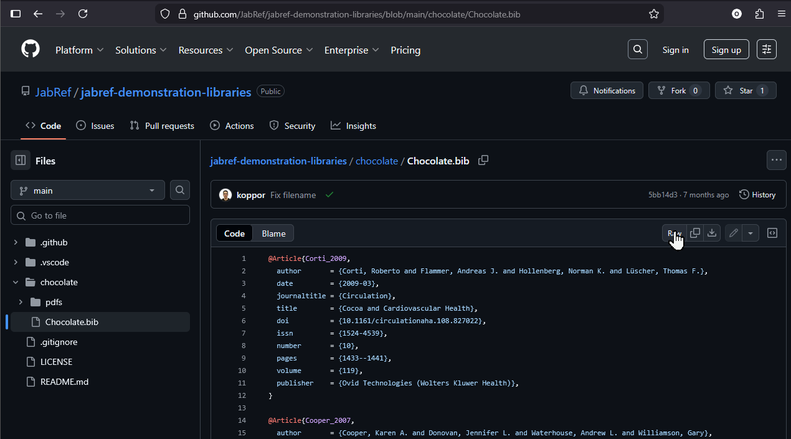
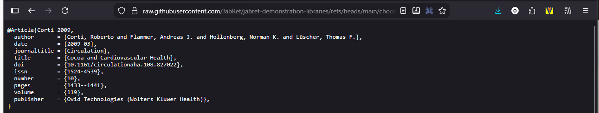
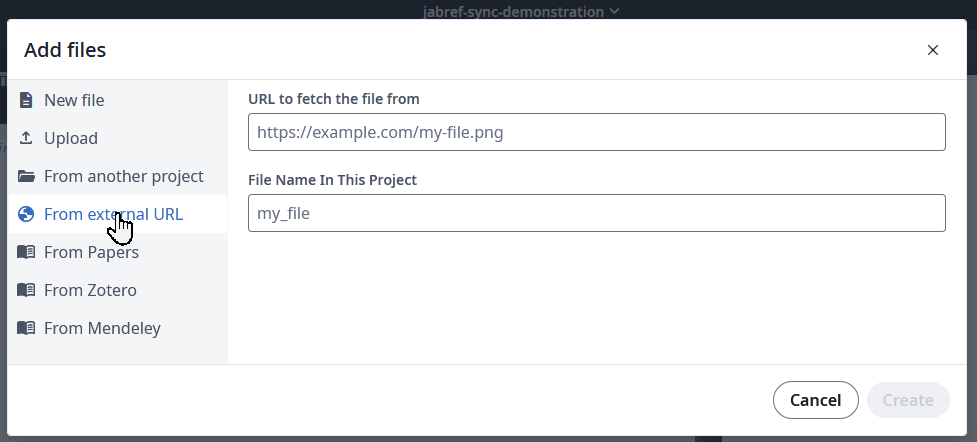
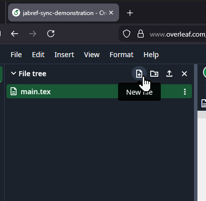
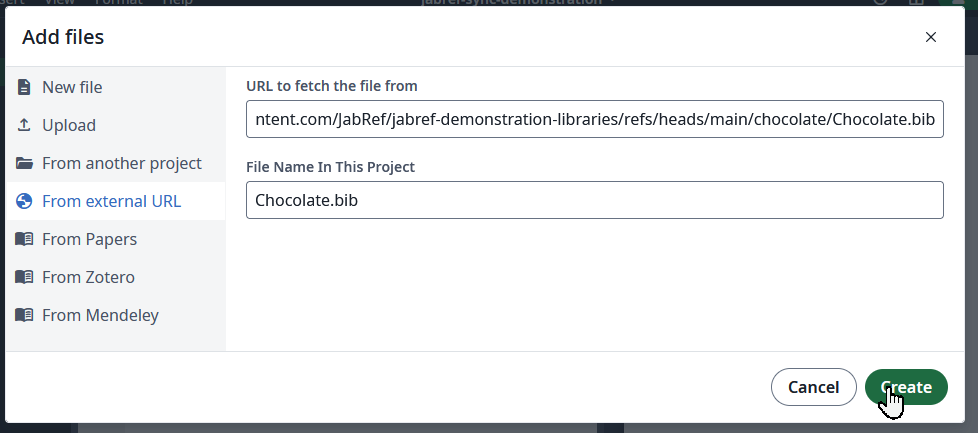
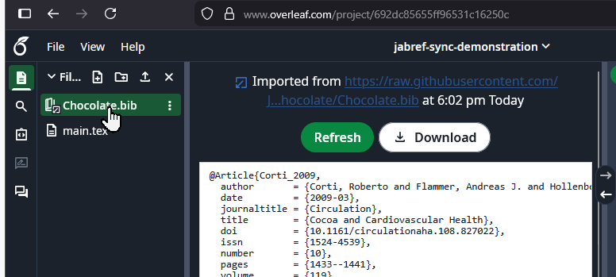

Keeping your literature database in sync across tools can be painful. With the new Git Support in JabRef, you can push your `.bib` file directly to GitHub—and Overleaf can fetch it from there. This creates a simple, one-way synchronization setup: **JabRef → GitHub → Overleaf**.

Below is a short walkthrough showing how to connect your GitHub-hosted BibTeX file with your Overleaf project.

## 1. Push your `.bib` file to GitHub

JabRef’s Git integration (see [the announcement post](../../../../2025/11/11/introducing-git-integration-in-jabref/)) lets you commit and push your bibliography to any Git provider, including GitHub. Once the file is in your repository, navigate to it in the GitHub web UI.

Click **Raw**.

Then, the browser loads the raw file - and shows the URL:

Copy the URL shown in the browser’s address bar. Overleaf will pull your `.bib` file from exactly this URL.

## 2. Add the external `.bib` file in Overleaf

Switch to your Overleaf project.

Create a new file.

Choose **From external URL**.

Paste the Raw GitHub URL you copied earlier and click **Create**.

Overleaf now links this file instead of storing a local copy.

## 3. Refresh the bibliography when it changes

Whenever you update your `.bib` file in JabRef and push to GitHub, Overleaf can fetch the new version.

Open the file in Overleaf and click **Refresh**.
Now, Overleaf downloads the most recent copy of the `.bib` file and makes it availble in your project.
You can use the "Refresh" button each time you think, the `.bib` file might be outdated.

## Acknowledgment

Thanks to our friends at **[CiteDrive](https://www.citedrive.com/)** for sharing this neat trick.

> This feature is available in JabRef since [v6.0-alpha.3](https://github.com/JabRef/jabref/releases/tag/v6.0-alpha.3)
{: .prompt-tip }
