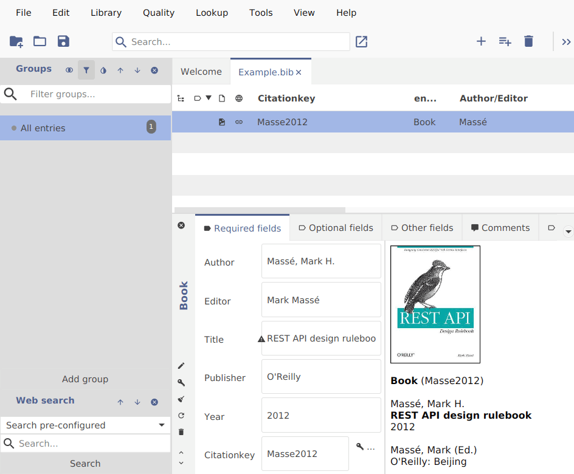

In the spirit of this year's winter olympics 🇮🇹 ❄️ 🏟️, we are proud to announce a winner as well: A new JabRef version...

And JabRef once again got accepted for this year's [Google Summer of Code (GSOC)](https://summerofcode.withgoogle.com/programs/2026/organizations/jabref-ev)

We are happy to announce the release of **JabRef 6.0 Alpha 5**, the next step towards the stable version of JabRef 6.0.

## Release Highlights

This release focused on improving the citations tab interface and including new fetchers for citations based on [OpenCitations](https://opencitations.net/) and [OpenAlex](https://openalex.org/).

In addition, we fixed some bugs related to migration from an older version or the startup on linux ARM systems.
As always, we polished the user interface and improved the usability.

If you have book entries in JabRef, it’s now possible to automatically fetch book covers for these entries. You can enable it in the preferences.

For more details, please see the [release notes](https://github.com/JabRef/jabref/releases/tag/v6.0-alpha.5).

## Google Summer of Code

JabRef once again got accepted for this year's GSOC. We’re thankful for this opportunity.

You can find the [List of ideas](https://jabref.github.io/GSoC/projects/) and the guide for applying on JabRef's GSOC page.

### Special Thanks

This time a special thanks to [Terry Bollinger](https://terrybollinger.com/) for sponsoring JabRef!

It’s people like him who help keep this software going.

We thank all the external contributors who contributed code to this JabRef release.

|  |  |  |  |
| --  | --  | --  | --  |
| Aydan Whitton |  |  |  |
|  | [Abhishek kumar](https://github.com/abhishek9773) | [Adam Antal](https://github.com/st-rm-ng) | [alxafan](https://github.com/alxafan) |
|  |  |  |  |
| [Anton](https://github.com/gluck243) | [Ashvin](https://github.com/betheashvin) | [Atul Raman](https://github.com/atul-raman) | [atulr](https://github.com/atulr) |
|  |  |  |  |
| [Aydan](https://github.com/bblhd) | [Bohdan](https://github.com/BOgdAnSAM-sudo) | [colinseifert](https://github.com/colinseifert) | [Faneesh Juneja](https://github.com/faneeshh) |
|  |  |  |  |
| [Gabriele Di Menna](https://github.com/Gabriele-DM-unimol) | [Gabriele-DM](https://github.com/Gabriele-DM) | [ganesh](https://github.com/ganesh) | [Ganesh ](https://github.com/ganesh-vk) |
|  |  |  |  |
| [Hamsyz](https://github.com/Hamsyz) | [Hancong Zhang](https://github.com/pluto-han) | [Hrishi-Baskaran](https://github.com/Hrishi-Baskaran) | [Jalina2007](https://github.com/Jalina2007) |
|  |  |  |  |
| [Jendrik Johannes](https://github.com/jjohannes) | [Kollakota Siva Sai](https://github.com/Siva-Sai22) | [Lang Liu](https://github.com/LangInteger) | [Lithin C G](https://github.com/lithincg) |
|  |  |  |  |
| [Loay Tarek Mostafa](https://github.com/LoayTarek5) | [Miron Ustiantsev](https://github.com/cursedesigner) | [NiMv1](https://github.com/NiMv1) | [OnNorveg](https://github.com/OnNorveg) |
|  |  |  |  |
| [Panagiotis Andreou](https://github.com/panosandreou1) | [Prasanth](https://github.com/D-Prasanth-Kumar) | [priyanshu](https://github.com/priyanshu) | [Priyanshu gupta](https://github.com/Priyanshug254) |
|  |  |  |  |
| [Pulkit Bajaj](https://github.com/pulkitbajaj) | [Sangam Preetam](https://github.com/Preetam1804) | [shubham kapoor](https://github.com/shubhamk0205) | [Son Thien Nguyen](https://github.com/sonthien22501) |
|  |  |  |  |
| [Suraj Wadikar](https://github.com/suraj9562) | [Xu Shaohua](https://github.com/LiuLang) | [Zeyad Abdel Fattah](https://github.com/ZiadAbdElFatah) | [zoyabothra](https://github.com/zoyabothra) |
