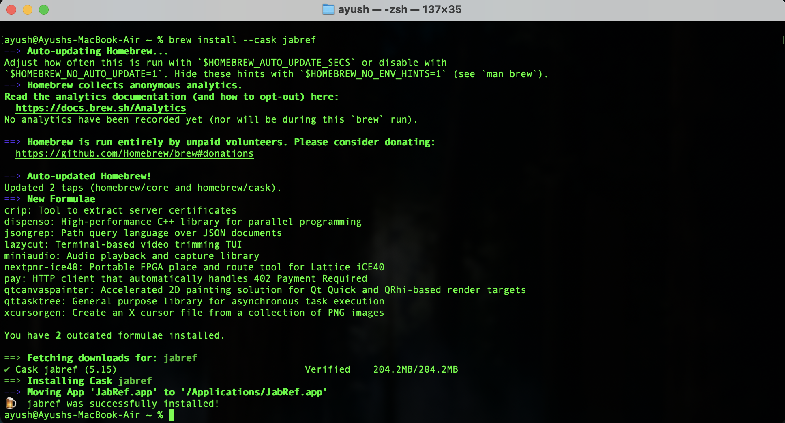
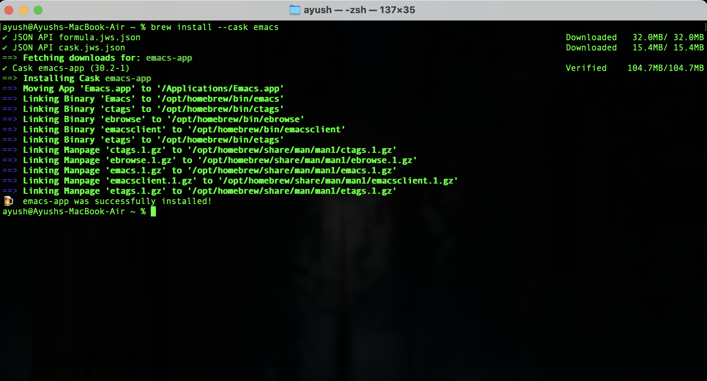
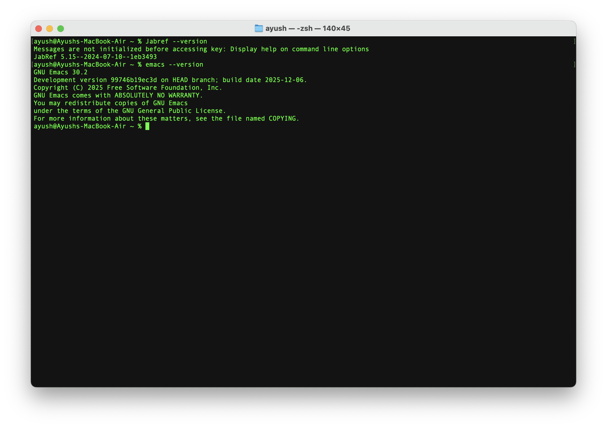
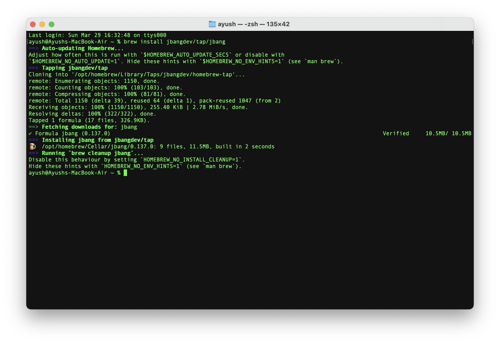
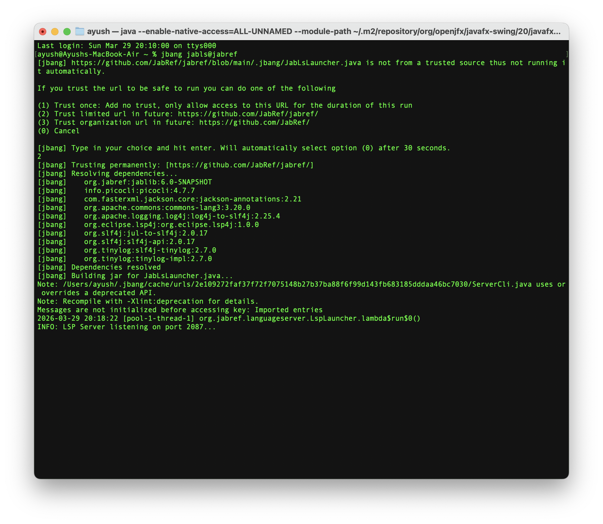
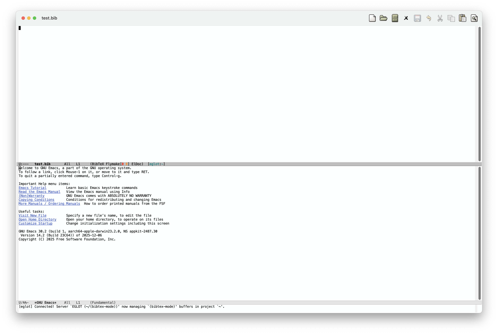
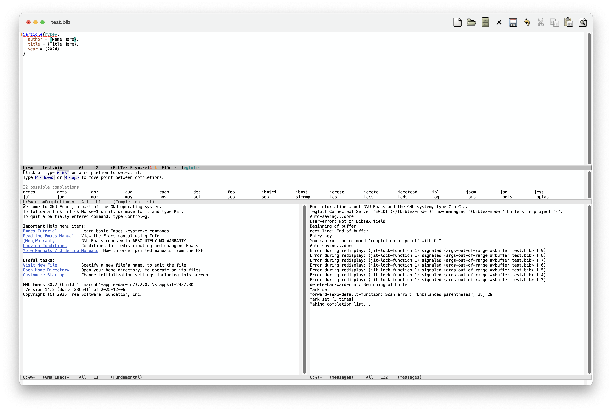

Hello! I'm Ayush, a student pursuing B.Tech in AI & Data Science Engineering at Guru Gobind Singh Indraprastha University, Delhi, India. I came across this task on GitHub while contributing to open source — the goal was to document the process of setting up Emacs with JabRef's LSP server. The setup took a full day of trial and error, but once everything clicked, it worked really well.

This guide covers everything that worked, so you don't have to go through the same process.

---

## What's happening here

JabRef has a built-in LSP server called **JabLS**. You run it in the background, connect Emacs to it via `eglot`, and you get autocomplete, diagnostics, and more when editing `.bib` files.

There are two ways to get the LSP server running - using `jbang` (works with the stable JabRef release), or using the development build of JabRef which lets you enable LSP directly from Preference. I tested the `jbang` approach personally, so that's what this guide covers in detail. The macOS steps here should also be relatively easy to adapt for Linux and Windows.

---

## What you need

- macOS (tested on Apple M2)
- Homebrew (package manager for macOS)
- Emacs 29 or later
- JabRef 5.x or later
- Basic comfort with Terminal

---

## Method 1 - Using jbang (recommended for stable release)

### Step 1 - Install JabRef

```bash
brew install --cask jabref
```



JabRef installs as an app on macOS, so you need to add it your PATH manually:

```bash
echo 'export PATH="/Applications/JabRef.app/Coctents/MacOS:$PATH"' >> ~/.zprofile
source ~/.zprofile
```

### Step 2 - Install Emacs

```bash
brew install --cask emacs
```



Verify both are installed:



### Step 3 - Install jbang

[jbang](https://www.jbang.dev) is a tool for running Java apps without a full build setup. JabLS uses it.

```bash
brew install jbangdev/tap/jbang
```



Then trust the JabRef source:

```bash
jbang trust add https://github.com/JabRef/jabref/
```

When prompted, type `2` to trust the JabRef repository permanently.

### Step 4 - Start the JabLS server

Open a Terminal window and run:

```bash
jbang jabls@jabref
```

The first time, it downloads some dependencies. wait for it - when you see this line, the server is ready:

```
INFO: LSP Server listening on port 2087...
```



> **Important** Keep this Terminal window open. The LSP server needs to stay running while you edit `.bib` files in Emacs.

### Step 5 - Configure Emacs

Open your Emacs config file with `Ctrl + X` then `Ctrl + F`, type `~/.emacs.d/init.el` and press Enter.

Add this Config:

```elisp
(require 'package)
(add-to-list 'package-archives
             '("melpa" . "https://melpa.org/packages/") t)
(package-initialize)
 
(require 'eglot)
 
(add-to-list 'eglot-server-programs
             `(bibtex-mode . ("localhost" 2087)))
 
(add-hook 'bibtex-mode-hook 'eglot-ensure)
```

Save with `Ctrl + X` then `Ctrl + S`.

> **Note:** We use `eglot` here because it ships built-in with Emacs 29+ and connects to JabLS cleanly over TCP. No extra packages needed.

### Step 6 - Test it

Open a `.bib` file in Emacs:

```bash
emacs ~/Desktop/test.bib
```

You should see `[eglot:~]` appear in the mode line at the bottom - that means Emacs is connected to JabLS.



Now type a BibTex entry and press `Ctrl + Alt + i` to trigger autocomplete:

```bibtex
@article{mykey,
  author = {Name Here},
  title = {Title Here},
  year = {2024}
}
```

Place your cursor inside the `author` field, delete `Name Here`, and press `Ctrl + Alt + i` to trigger autocomplete.



That's 32 completions from JabRef's database, right inside Emacs. This is the moment it all clicks.

---

## Method 2 - Using JabRef's development build (alternative)

If you'd rather not use `Jbang`, the development build of JabRef includes an option to enable the LSP server directly from JabRef's **Preferences** - no extra tools needed.

Download the latest development build for your platform from:

**https://builds.jabref.org/main/**

Pick the right folder for your system (`macOS-silicon` for Apple M2/M3, `macOS-intel` for older Macs, `linux-amd64` for Linux, `windows-amd64` for Windows).

Once installed, open JabRef --> go to **Preferences** --> look for the **LSP server** option and enable it. The server will start automatically when JabRef is open, and you can connect Emacs to it using the same `eglot` config from step 5 above.

---

## Every time you use it (Jbang method)

JabLS doesn't start automatically - start it before opening Emacs:

```bash
# Termainal 1 - Keep open
jbang jabls@jabref

# Terminal 2 - open your file
emacs yourfile.bib
```

---

## Troubleshooting

**`jabref: command not found`**
Add Jabref to your PATH as shown in step 1.

**Eglot not connecting**
Make sure the JabLS server is running and showing `listening on port 2087` before opening Emacs.

**No completions appearing**
Make sure your cursor is inside a BibTex field value, not on the citation key. Press `Ctrl + Alt + i` to trigger completions manually.

---

## Wrapping up

The trickiest part was figuring out that JabLS is the correct server - not `jabref --lsp`, which doesn't exist in the stable release. And that `eglot` works better than `lsp-mode` for connecting to it.

Once those two things clicked, the rest was straightforward. If you run into anything unexpected, the [JabRef issue tracker](https://github.com/JabRef/jabref/issues)
is active and the maintainers respond quickly.

