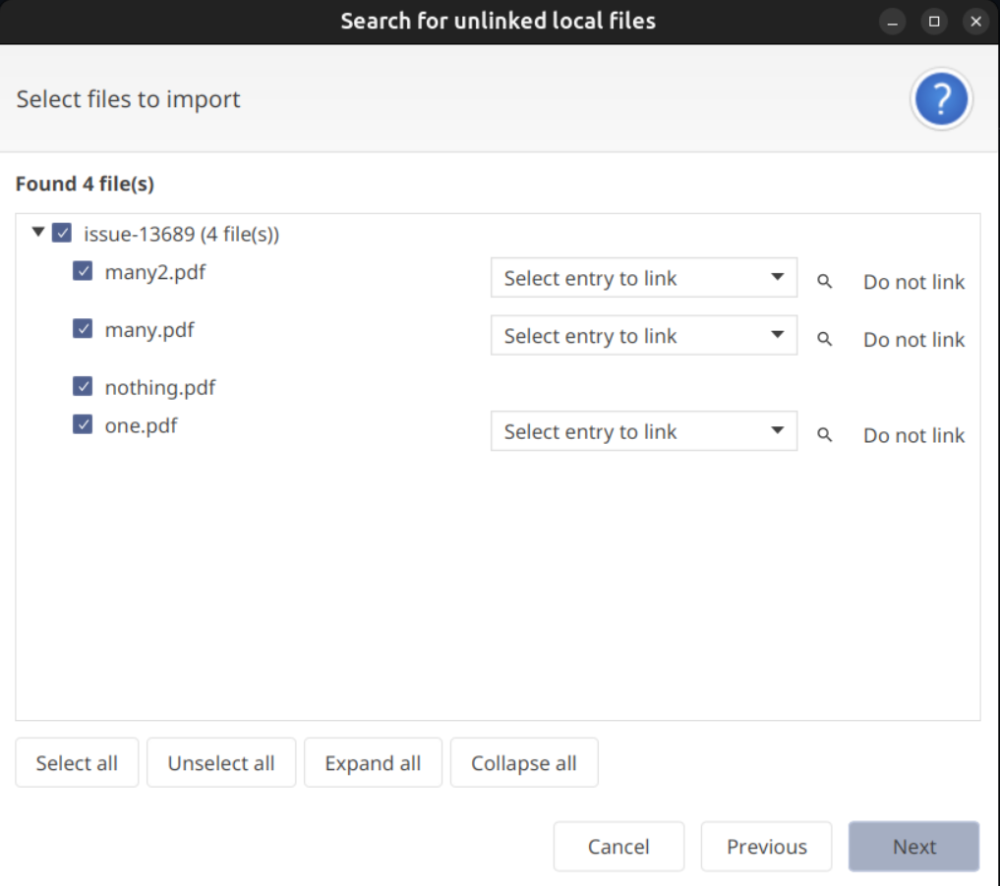

It's just May and we again have a full changelog since the last release.

We are happy to announce the release of **JabRef 6.0 Alpha 6**, the next step towards the stable version of JabRef 6.0.

It's formally an alpha release because we have a couple of things left in our backlog for a Beta version. But nonetheless this version includes plenty of fixes and improvements and thus we invite everyone to try out this version and report any encountered issues to make JabRef even more stable.

## Release Highlights

- Improved theming in JabRef
- Revamped notifications and pop-up toast into a single center info center.
- Improved citation count and the citation feature, e.g you can now chose between different fetchers for updating the citation count. Drag and drop of entries from the citation tab is also now possible.

- Improved generation and and handling of inserted citations in LibreOffice
- Web search now accepts publisher-specific query syntax as well
- Unlinked files now allows to link found files to existing related entries as well

Apart from these, there were plenty of bug fixes across all parts of JabRef. Check out our [Changelog](https://github.com/JabRef/jabref/blob/main/CHANGELOG.md) for all changes and fixes.

## Known issues

- Custom themes may not work in the current version, however we are working on making them compatible with the new theming system.

## Google Summer of Code

JabRef is participating in GSOC this summer with three projects:

- Zeyad Abdelfattah will be working on "Improved handling of older documents with OCR and AI-powered tools."
- Hancong Zhang will work on "Improved LibreOffice-JabRef integration" with one particular aspect of compatibility with other reference managers.
- Wanling FU will work on improving startup times for our CLI-based tool JabKit by leveraging the power of Hashtag GraalVM.

Stay tuned for more project updates during the summer.

### Special Thanks

This time a special thanks to [Terry Bollinger](https://terrybollinger.com/) for sponsoring JabRef!

A special thanks to [@Maran23](https://github.com/Maran23) who fixes longstanding bugs in the UI framework JavaFX that surfaced in JabRef.

Another special shootout goes to the contributors [@faneesh](https://github.com/faneeshh) and [@LoayTarek5](https://github.com/LoayTarek5) who are working together on improving the SLR feature in JabRef and are supporting the JabRef maintainers with code reviews.

It’s people like these who help keep this software going.

We thank all the external contributors who contributed code to this JabRef release.

|  |  |  |  |
| --  | --  | --  | --  |
|  |  |  |  |
| [AbhijitBhowmick](https://github.com/AbhijitBhowmick) | [Afra](https://github.com/Afra0704) | [Aidan McCarthy](https://github.com/aidanmcc02) | [Alex Connick](https://github.com/alex-connick) |
|  |  | Amanda Erickson |  |
| [Ali Yasir Naç](https://github.com/aliyasirnac) | [alxafan](https://github.com/alxafan) |  | [amandaErickson](https://github.com/amandaErickson) |
|  |  |  |  |
| [AnasKh21](https://github.com/AnasKh21) | [Andrea](https://github.com/andreazhang) | [Andrea Zhang](https://github.com/andrea02polimi) | [AnittaV](https://github.com/AnittaV) |
|  |  |  |  |
| [anuv-bit](https://github.com/anuv-bit) | [Anvita Prasad](https://github.com/AnvitaPrasad) | [Aritra Banerjee](https://github.com/programmer1128) | [Arpit Nege](https://github.com/OfficialArpitNege) |
|  |  |  |  |
| [Bohdan](https://github.com/BOgdAnSAM-sudo) | [codepurple007](https://github.com/codepurple007) | [Copilot](https://github.com/apps/copilot-swe-agent) | [Eduardo Kurek](https://github.com/eduardo-kurek) |
|  |  |  |  |
| [Faneesh Juneja](https://github.com/faneeshh) | [Francis-Lee-210](https://github.com/Francis-Lee-210) | [Fynnian Brosius](https://github.com/FynnianB) | [gandhroh000](https://github.com/gandhroh000) |
|  |  |  |  |
| [ganesh](https://github.com/ganesh) | [Ganesh](https://github.com/ganesh-vk) | [geovani-rocha](https://github.com/geovani-rocha) | [German](https://github.com/DawydowGerman) |
|  |  |  |  |
| [grigolli](https://github.com/pgrigolli) | [Hager Khamis](https://github.com/hagerm98) | [Hancong Zhang](https://github.com/pluto-han) | [JADE](https://github.com/JADE) |
|  |  |  |  |
| [jadegold55](https://github.com/jadegold55) | [Jendrik Johannes](https://github.com/jjohannes) | [Jonas](https://github.com/jonas-ee) | [JunWang222](https://github.com/JunWang222) |
|  |  |  |  |
| [just-another-coder](https://github.com/justanothercoder-hub) | [Kollakota Siva Sai](https://github.com/Siva-Sai22) | [Loay Tarek Mostafa](https://github.com/LoayTarek5) | [Marius Hanl](https://github.com/Maran23) |
|  |  |  |  |
| [melkerolle](https://github.com/melkerolle) | [MelkerT](https://github.com/MelkerT) | [Mike Zhang](https://github.com/mikezhanghaozhe) | [Mukul Ghare](https://github.com/MukulGhare) |
|  |  |  |  |
| [Nishant Dasgupta](https://github.com/NishantDG-SST) | [Paul](https://github.com/TheCoder777) | [Pedro Belo](https://github.com/pedro) | [Phaneendra Kanduri](https://github.com/Phaneendra2005) |
|  |  |  |  |
| [Prasanth](https://github.com/D-Prasanth-Kumar) | [Prasanth Cherukuri](https://github.com/prasanthcp) | [Priyanshu Gupta](https://github.com/priyanshu16095) | [RakockiW](https://github.com/RakockiW) |
|  |  |  |  |
| [sam-r914](https://github.com/sam-r914) | [Schuyler Ridenour](https://github.com/ridsch) | [Shashank](https://github.com/shawshank725) | [Somde](https://github.com/Chiragsd13) |
|  |  |  |  |
| [Statxc](https://github.com/statxc) | [Syimyk43](https://github.com/Syimyk43) | [tianchunli](https://github.com/tianchunli) | [Vonica Paul](https://github.com/DarkMysterio) |
|  |  |  |  |
| [YashUkhare](https://github.com/YashUkhare) | [Zeyad Abdelfattah](https://github.com/ZiadAbdElFatah) |  |  |

## Download

[Download for all platforms](https://github.com/JabRef/jabref/releases/tag/v6.0-alpha.6)
