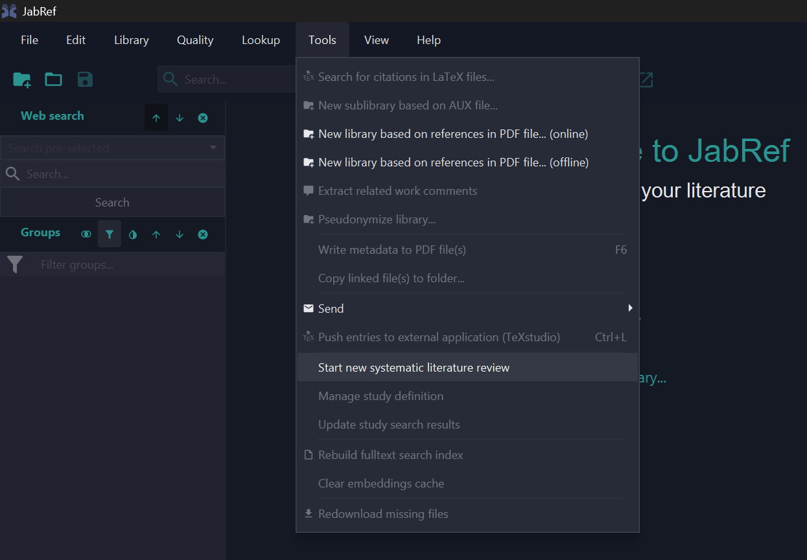
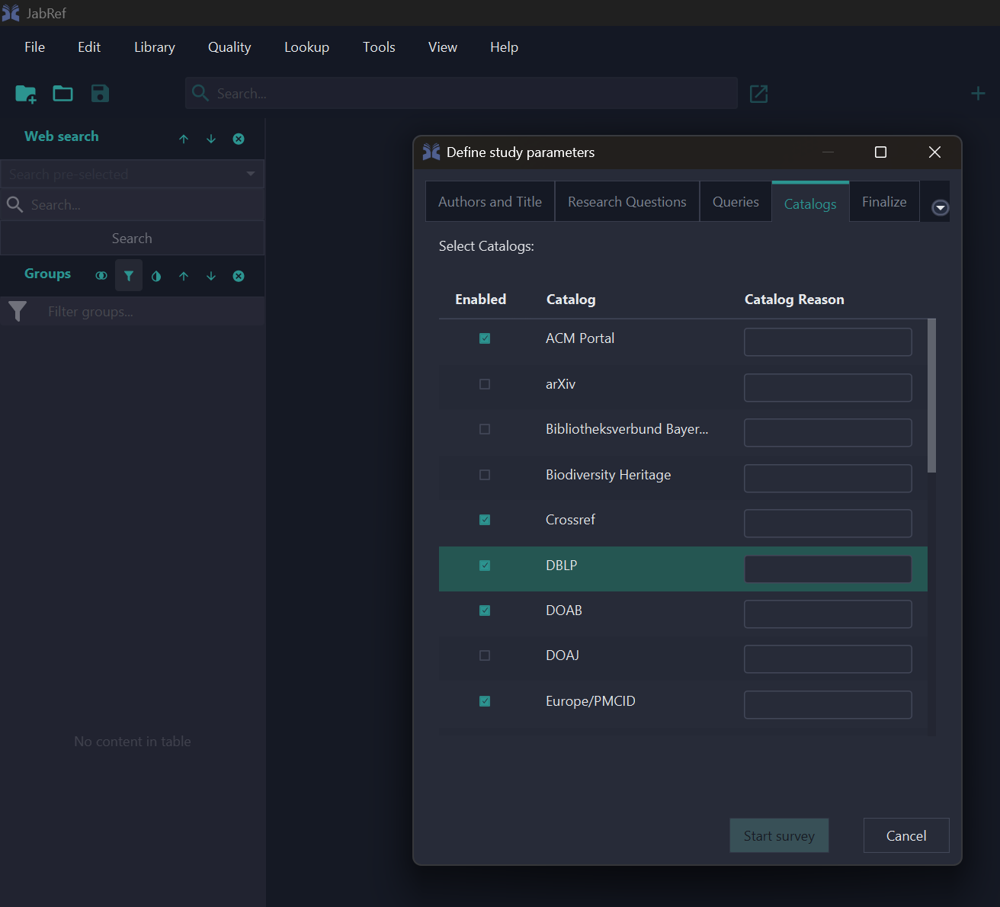
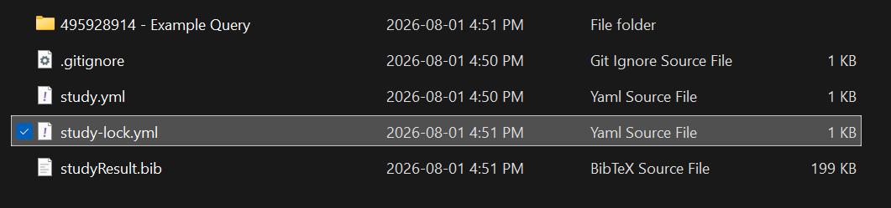
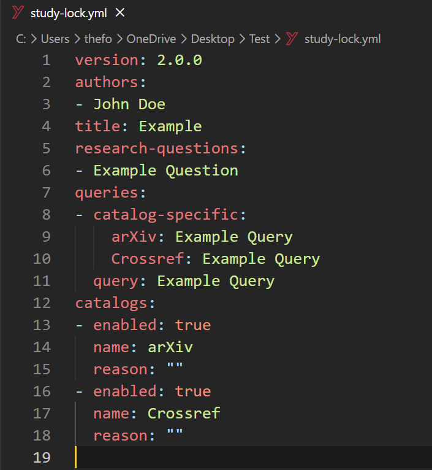

Hi, we're Loay and Faneesh. This summer, we added two meaningful pieces of functionality to **Systematic Literature Review (SLR)** support in JabRef: you can now give any catalog its own native search query instead of relying only on JabRef's translated one, and every search you run is now fully reproducible, recorded exactly as it happened. Rather than walking through a changelog, we thought it'd be easier to show you how it works through a concrete example.

Say you're running a review on mobile health apps for diabetes self-management, a common topic in health informatics SLRs. You'd start from **Tools → Start new systematic literature review**, where you write your research questions, a general search query, and pick which catalogs to search: IEEE, PubMed/Medline, ACM, whichever fits your topic.

JabRef then queries every catalog you picked and merges the results. This part of SLR support has been in JabRef for a while, and it's built on real research into what SLR tooling actually needs. Dominik Voigt, Oliver Kopp, and Karoline Wild [catalogued these requirements back in 2021](https://ceur-ws.org/Vol-2839/paper13.pdf), and one gap they flagged had been sitting on [JabRef's own wish list](https://github.com/JabRef/jabref/wiki/GSOC-2024-ideas-list) for years: JabRef translates your query into each catalog's own format, but you can't give a catalog its own native query directly. That's the gap we spent the summer working on.

## When the general query isn't enough

Here's the problem we kept running into while building this. PubMed doesn't just accept plain keyword searches. It has its own MeSH (Medical Subject Headings) syntax, and something like `"Mobile Applications"[MeSH] AND "Diabetes Mellitus"[MeSH]` is a much more precise query, but it only means anything to PubMed. Every general query language is a compromise across catalogs, and at some point you hit a wall it just can't get past.

So now you can give a catalog its own **native query**, right alongside your general one:

Give PubMed the MeSH query above, and JabRef sends it through exactly as written, no translation. Every other catalog you've enabled still gets your general query. You only reach for this when you actually need it.

## Knowing exactly what ran

This is our favorite part of what we built. Every time you run a crawl, JabRef writes a `study-lock.yml` file next to your study definition, recording the exact query sent to every catalog. The MeSH query for PubMed in our example, the general query for everyone else.

Why does this matter? Because six months from now, when a reviewer asks what exactly you searched, you don't have to try to reconstruct it from memory. It's right there in the file. And if you re-run the same study without changing anything, you get an identical lock file back every time. The search is reproducible, not just "close enough."

Your results also land as per-catalog `.bib` files in a git-tracked study folder, so the whole history, every crawl and every result set, is versioned rather than just your final snapshot.

## One more thing

Once your study's set up, there's also a one-click "Share on SearchRxiv" button in the same dialog, if you want to publish your search protocol alongside your review.

## Try it out

If you do serious review work, these changes should help: native queries for when the general syntax doesn't cut it, and a lock file that records exactly what ran. Grab the [latest development build](https://builds.jabref.org/main/) to try it out, and if you want to dig into how the routing and lock file work under the hood, we wrote up the details in a [developer deep-dive](https://github.com/JabRef/jabref/blob/main/docs/code-howtos/slr.md).

Thanks to [koppor](https://github.com/koppor), [subhramit](https://github.com/subhramit), [calixtus](https://github.com/calixtus), and [Siedlerchr](https://github.com/Siedlerchr) for reviewing this across several rounds, and to Dominik Voigt and the rest of the SLR tooling research community, whose work shaped what this feature looks like.

Found a bug, or have feedback? Let us know on the [forum](https://discourse.jabref.org/c/feedback/3) or [open an issue](https://github.com/JabRef/jabref/issues).
