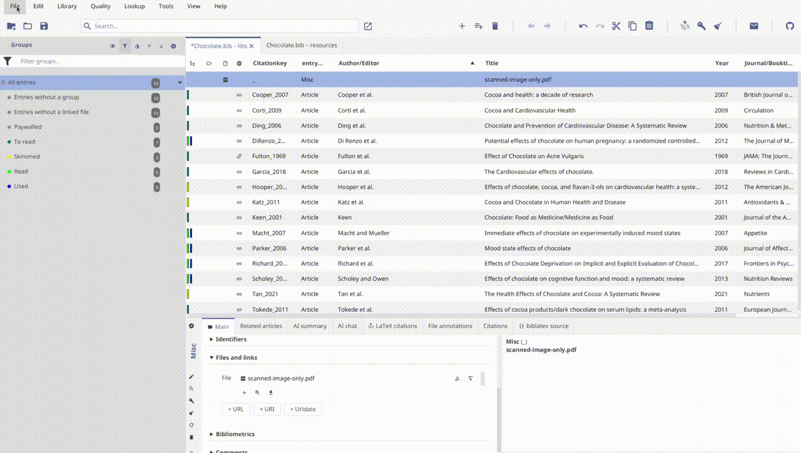

Hi, I am Zeyad. I am a [Google Summer of Code (GSoC) student at JabRef](https://summerofcode.withgoogle.com/programs/2026/projects/G9vyuNcs) this year, and I will be walking you through the new OCR and AI integration I built for JabRef.

## Background

JabRef already does a great job at managing metadata and text-based PDFs, letting you search, tag, and cross-reference your library with ease. But that search only works if the PDF actually has text in it. Historical papers, scanned articles, and old library archives are often just images of pages, with no underlying text layer at all, meaning JabRef (and you) can't search inside them.

This project closes that gap by bringing OCR (Optical Character Recognition) directly into JabRef, so scanned PDFs can be turned into full-text-searchable documents without ever leaving the app.

## What's New?

With this integration, JabRef users can now:

- **Run OCR from inside JabRef**: Select a PDF and run OCR on it directly, with a dedicated shortcut (CTRL+ALT+R), or through right-click and the file menu.
- **Choose an OCR engine**: Switch between OCRmyPDF and Docling depending on your needs.
- **Configure engine paths**: Point JabRef to a custom install location, or let it auto-detect the engine automatically.
- **Control how existing text is handled**: Skip pages that already have text, overwrite it, or redo OCR on pages that already carry an OCR text layer.
- **Compare original and OCRed files**: Open the OCRed file straight from a notification, and compare it against the original.

## Getting Started

To start using this new feature:

1. Download the [development version of JabRef](https://builds.jabref.org/main/).
2. Install [OCRmyPDF](https://github.com/ocrmypdf/OCRmyPDF#installation) or [Docling](https://github.com/docling-project/docling#1-install) on your machine.
3. Open JabRef's OCR preferences and set (or auto-detect) your engine path, and choose which engine to use.
4. Right-click a scanned PDF attached to an entry and run OCR, or use the (CTRL+ALT+R) shortcut.
5. Once done, a notification lets you open the OCRed file directly.

### Demo

## Summary

This OCR integration addresses a long-standing gap for anyone working with scanned or historical PDFs in JabRef, letting full-text search work on documents that previously had no text layer at all.

If you are interested in the technical details of how this project was undertaken, do check out the [GSoC 2026 final report](https://github.com/JabRef/jabref/wiki/GSoC-2026-%E2%80%90-OCR-and-AI-Integration-for-JabRef), which links every pull request that went into the feature.

I hope this new feature helps you get more out of your scanned literature. As always, [feedback and suggestions for further improvements](https://discourse.jabref.org/c/feedback/3) are welcome.

Happy OCRing!
