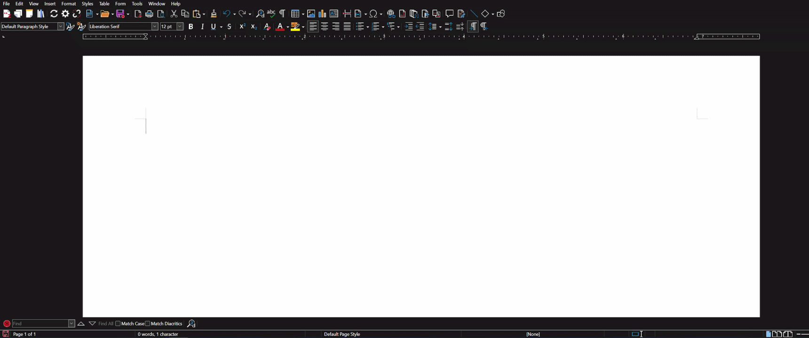
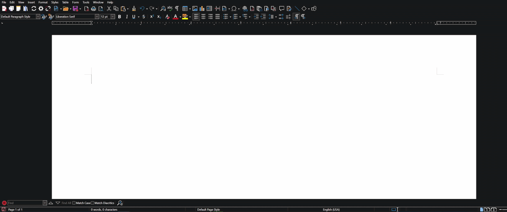
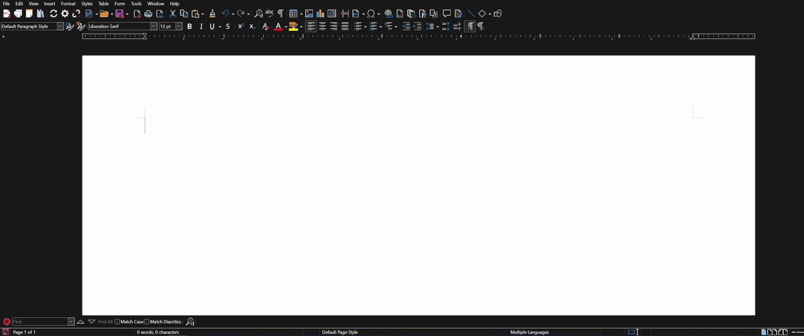

Hi, I am Hancong. I am a [Google Summer of Code (GSoC) student at JabRef](https://summerofcode.withgoogle.com/programs/2026/projects/Aj2w4sr7) this year, and I will be walking you through JabRef's new features for LibreOffice.

## Background

JabRef introduced support for CSL styles in its LibreOffice integration [back in 2024](https://blog.jabref.org/2024/08/26/GSoC-CSL/), allowing users to insert CSL-formatted citations directly into their documents. However, there were many existing issues. One of them was that numeric citations inserted in footnotes behaved unexpectedly with regards to their numeric order.

In addition, JabRef had no interoperability with other reference management tools such as Zotero. This made collaboration difficult when people working on the same document used different tools. In comparison, Zotero and Mendeley could read and work with each other’s citations in LibreOffice.

The goal of my project therefore was to implement compatibility of JabRef's CSL citations with Zotero, fix their behavior in footnotes, and make the overall LibreOffice/OpenOffice integration more stable. The good news is that the project has made good progress in all these areas!

## What's New?

With these improvements, JabRef users can now:

- **Read documents with Zotero citations**: Before, JabRef could not recognize citations inserted by Zotero. It can now read and work with them to enable collaboration.
- **Insert citations that Zotero can read**: JabRef can now create Zotero-compatible citations, making it easier to work on the same `.odt` document in Zotero.
- **Synchronize citation styles with Zotero**: Apart from recognizing/inserting Zotero-style citations, JabRef can now also infer the citation styles used in the document and keep it synchronized.
- **Insert footnotes safely**: Citation numbering in the footnotes is now kept consistent within themselves, and also with citations in the main text.
- **Choose more options in settings**: Users now have more options in the LibreOffice panel settings, giving them more fine-grained control over how the citations behave.

## Getting Started

To start using this new feature:

1. Download the [development version of JabRef](https://builds.jabref.org/main/).
2. Download Zotero.
3. Open any library in JabRef, such as example library from the welcome screen.
4. Import the same .bib file into Zotero.
5. Open any LibreOffice document, insert some citations using Zotero.
6. Connect to the same LibreOffice document instance by either clicking the "Connect" or the "Manual Connect" button in the [Libre/OpenOffice Panel](https://docs.jabref.org/cite/openofficeintegration) of JabRef's side pane.
7. Enable Zotero-compatible mode in settings, and "infer style" mode if you want to synchronize styles.
8. Start to cite.

### Demo
#### Read and insert Zotero-style reference mark

#### Synchronize styles

#### Footnote citations

## Summary

This project successfully improved JabRef’s compatibility with Zotero and made the OpenOffice integration more robust and reliable. I hope these improvements make your research and writing workflow a little smoother.

If you are interested in the technical details and the decisions behind this work, please have a look at the [wiki](https://github.com/JabRef/jabref/wiki/GSoC-2026-%E2%80%90-Improved-LibreOffice%E2%80%90JabRef-integration).

Finally, I would like to end by borrowing Boromir’s famous line, with a small twist: "_One does not simply define interoperability._" Designing software is one thing; making it work well with other software is another. Interoperability is rarely something that can be defined once and considered finished. There will always be edge cases to understand, features to improve, and bugs to fix and the implementation details, if interoperability is a desirable outcome, then may have to be propagated across the ecosystem, which can require coordination or even negotiations. The JabRef OpenOffice integration is still evolving, and there is plenty of room for further improvement. If you use it, your [feedback, ideas](https://discourse.jabref.org/), and [bug reports](https://github.com/JabRef/jabref/issues) are always very welcome. They can help to make the OpenOffice component even better.

Happy citing!

