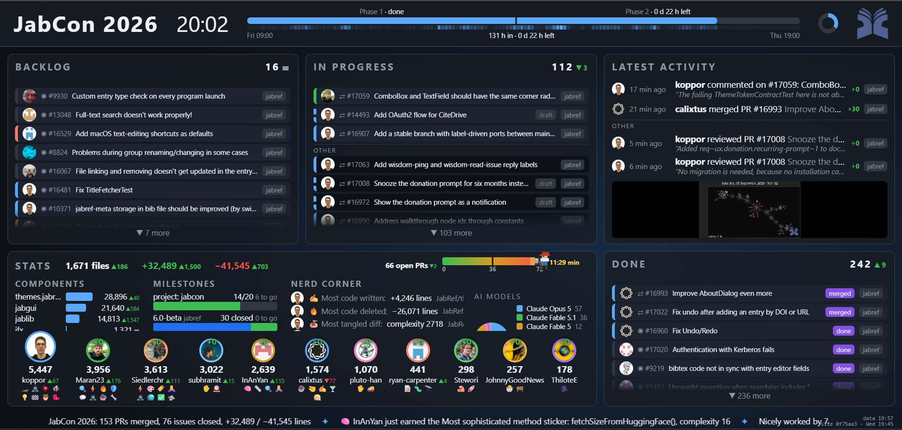

From Friday, September 4, to Thursday, September 10, 2026, the annual [JabCon](https://jabcon.jabref.org/) took place in Sindelfingen, Germany, where the majority of the JabRef maintainers and some members of our non-profit organization JabRef e.V. met in person and worked together to improve JabRef and discuss the roadmap for future releases.

This year we focused on preparing the 6.0-beta release and fixing release-critical issues. As you can see in our [JabCon dashboard](https://jabref.github.io/jabcon-board/) we were quite busy.

# Key Highlights

## Revamped entry editor

We revamped the entry editor to provide a more intuitive and user-friendly interface, especially the Main tab

The new unified “Main” tab brings an entry’s fields, files, identifiers, comments, and metadata into one streamlined view—alongside faster ways to add entries from URLs and navigate directly to fields.

TODO: Screenshots

## LibreOffice improvements and Zotero compatibility

This year's GSOC project by Hancong focused on improving JabRef's compatibility with LibreOffice and Zotero, and these changes are tougher with other improvements

Major improvements include Zotero-compatible CSL citations, Track Changes support, .bst bibliography generation, richer “Cite special” options, and more reliable citation formatting and ordering.

## Improved library management and collaboration

Git support becomes more practical with semantic diffs, one-click commit-and-push, automatic Git actions, and safer commits. 

The revamped shared database feature with PostgreSQL now allows a smoother collaboration and synchronization of bibliographic data across multiple users and devices.

We are excited for next year's JabCon and will be heading to the next JabRef release!

## New Theming System

We have introduced a new theming system that allows users to customize the look and feel of JabRef to their liking. This system provides a wide range of options for colors, fonts, and other visual elements, making JabRef more visually appealing and easier to use.

## GSOC

The Google Summer of Code (GSOC) program has been a great success for JabRef, with several students contributing valuable features and improvements to the software. We would like to thank all the students who participated in GSOC and made JabRef a better tool for everyone. 
Even more impressive is that participants took the adventure with the Deutsche Bahn and traveled to JabCon 2026 from the Netherlands and Switzerland.

## Special Thanks

We want to thank all the users who are constantly testing the latest snapshots and providing feedback!
Furthermore, we would like to thank our [donators](https://donations.jabref.org) and JabRef e.V. members who made it possible for many JabRef developers to attend the conference and to support our work.
In case you like to donate money on a regular basis, we would prefer via our bank account (tax-deductible and no fees) or via GitHub Sponsors as the fees are lower than PayPal.
