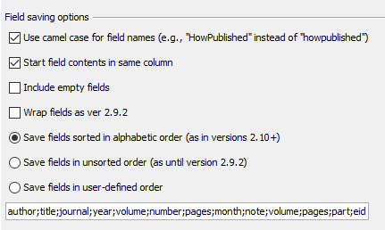
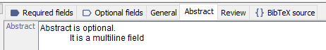
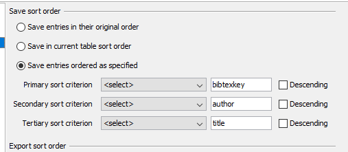
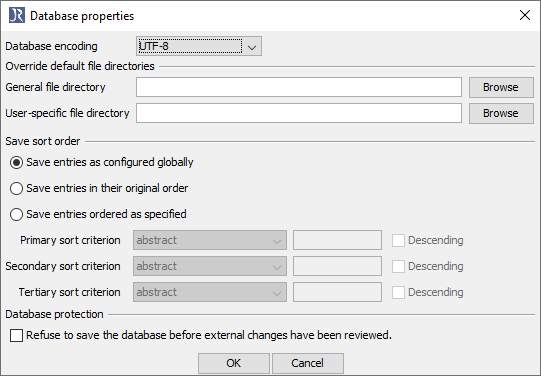
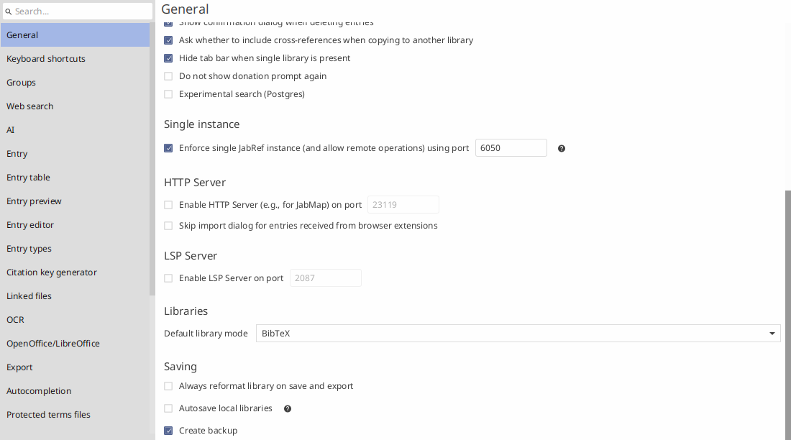
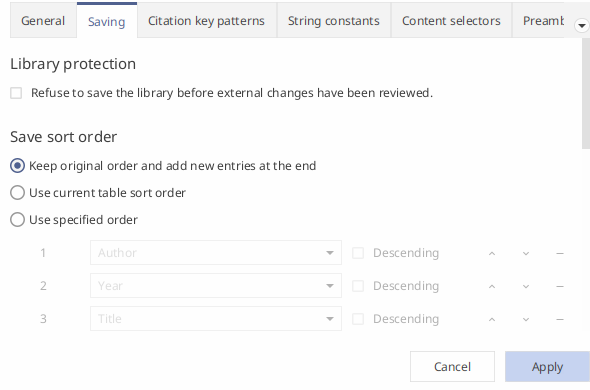

JabRef changed the way it writes a BibTeX file several times.
This blog post presents how the `.bib` file looks like for different JabRef versions.
The semantics of the content was never changed, but the "layout" in the file.
That lead to huge complaints over the time, especially when a group of researchers used different JabRef versions on the same file.

The JabRef team decided in 2015 that this side effect is not acceptable and that only the parts of the bibliography touched by JabRef should be rewritten.
This was implemented in JabRef 3.1, released on 2015-12-24.

The discussions on a "useful" serialization of BibTeX entries continue.
This blog post lists the evolution of JabRef's chosen serialization over time.
The aim is to i) make the changes over time transparent and ii) to support discussions on a "useful" serialization format.

The example used can be found in [bibtex-file-changes-over-time-demo.bib](/bib/bibtex-file-changes-over-time-demo.bib).
It was written by JabRef 2.9.2.
All outputs shown below were generated by opening this file with the respective JabRef version and saving it.

We illustrate the different serializations using the following artificial entry:

```bibtex
@PHDTHESIS{7,
  author = {Field, Required},
  title = {Title is required},
  absolutelycustom = {AbsolutelyCustom is a custom field},
  abstract = {Abstract is optional. It is a multiline field. Each line started with
	a tab character.}
}
```

The BibTeX entry type "PhdThesis" consists of required and optional fields.
Additionally, fields not defined by BibTeX can be added.
We call these fields "custom fields".

Please note that there is not really a "BibTeX standard".
Each BibTeX bibliography style file (`.bst`) defines the fields it displays in the bibliography on its own.
As a consequence, in some papers the `url` field is shown, in some it is not, even though it is defined in the `.bib` file.

## History

### JabRef 1.0 to 1.6

JabRef 1.0 was released in November 2003.
Up to JabRef 1.6 (November 2004), the format stayed the same:

- Types are in upper case letters: `@PHDTHESIS`
- Keys in lower case letters: `author`
- `author` and `title` come first, the other fields follow in no particular order
- The last field ends with a comma
- Long field content is wrapped. Each continuation line starts with a tab and a space.
  Line breaks and empty lines in the content are replaced by spaces.
- Entries of unknown types (here: `@COLLECTION`) and comments are dropped silently

```bibtex
@PHDTHESIS{7,
  author = {Field, Required},
  title = {Title is required},
  abstract = {Abstract is optional.
	 It is a multiline field. Each line started with a tab character.},
  absolutelycustom = {AbsolutelyCustom is a custom field},
}
```

The header consisted of a single line without a `%`:

```latex
This file was created with JabRef.
```

### JabRef 1.7

JabRef 1.7 was released in March 2005.

- The fields after `author` and `title` are sorted alphabetically.
- Custom entry types are stored in the file: `@comment{jabref-entrytype: Collection: req[booktitle;editor;publisher;year] opt[abstract;month;number;series;volume]}`.
  Entries of such types are kept.
- The header got a second line: `Encoding: UTF-8` (still without `%`).

```bibtex
@PHDTHESIS{7,
  author = {Field, Required},
  title = {Title is required},
  absolutelycustom = {AbsolutelyCustom is a custom field},
  abstract = {Abstract is optional.
	 It is a multiline field. Each line started with a tab character.},
}
```

### JabRef 1.8 to JabRef 2.9.2

JabRef 1.8 was released in July 2005.
It introduced the wrapping of long field content that stayed until JabRef 2.9.2.

- Types are in upper case letters: `@ARTICLE`
- Keys in lower case letters: `author`
- First the required fields, then the optional fields (each group sorted alphabetically)
- No alignment of key/value separators (`=`)
- Long field content is wrapped at approximately 70 characters. Each continuation line starts with a tab.
  A single line break in the content is treated as a space.
  Paragraphs have to be separated by an empty line (similar to LaTeX and Markdown).

```bibtex
@PHDTHESIS{7,
  author = {Field, Required},
  title = {Title is required},
  absolutelycustom = {AbsolutelyCustom is a custom field},
  abstract = {Abstract is optional. It is a multiline field. Each line started with
	a tab character.}
}

@ARTICLE{smith1980,
  author = {John Smith},
  title = {How I Weave Baskets Underwater},
  journal = {Journal of Underwater Basket Weaving and Nonsensical Latin Placeholder
	Texts},
  year = {1980},
  abstract = {Lorem ipsum dolor sit amet, consectetur adipiscing elit, sed do eiusmod
	tempor incididunt ut labore et dolore magna aliqua. Ut enim ad minim
	veniam, quis nostrud exercitation ullamco laboris nisi ut aliquip
	ex ea commodo consequat. Duis aute irure dolor in reprehenderit in
	voluptate velit esse cillum dolore eu fugiat nulla pariatur. Excepteur
	sint occaecat cupidatat non proident, sunt in culpa qui officia deserunt
	mollit anim id est laborum.}
}
```

The header included an advertisement on "JabRef":

```latex
% This file was created with JabRef 2.9.2.
% Encoding: UTF-8
```

JabRef 1.8 to 2.2 wrote the two header lines without the leading `%`.
These versions also ended the last field of an entry with a comma.

### JabRef 2.10

- Types in camel case: `@InProceedings`
- Keys in camel case: `Year`, `Url` - optionally in lower case
- (optional) Alignment of key/value separators (`=`)
- Separation of required and optional field with an empty line
- First the `title` of a paper, then other required fields, then the optional fields
- Line breaks in the field content are kept (and are not interpreted as LaTeX or Markdown does)
- Content wrapped by an older version (line break followed by a tab) is joined into one line

The changelog of JabRef 2.10 summarized the change as follows:

> Changed serialization of BibTeX entries:
> First, the required, then the optional and then all other fields are written.
> Thereby, fields are now ordered by name. Except the title, which is written first.
> The second word in of the BibTeX type is capitalized. E.g., Inproceedings got InProceedings.
> Configurable: Start field contents in same column. Enabled by default.
> Configurable: Use camel case for field names (e.g., "HowPublished" instead of "howpublished"). Enabled by default.
> If no field name is given, then "UNKNOWN" is used. For instance, " = {X}" gets " UNKNOWN = {X}".

```bibtex
@PhdThesis{7,
  Title                    = {Title is required},
  Author                   = {Field, Required},

  Absolutelycustom         = {AbsolutelyCustom is a custom field},
  Abstract                 = {Abstract is optional. It is a multiline field. Each line started with a tab character.}
}

@Article{smith1980,
  Title                    = {How I Weave Baskets Underwater},
  Author                   = {John Smith},
  Journal                  = {Journal of Underwater Basket Weaving and Nonsensical Latin Placeholder Texts},
  Year                     = {1980},

  Abstract                 = {Lorem ipsum dolor sit amet, consectetur adipiscing elit, sed do eiusmod tempor incididunt ut labore et dolore magna aliqua. Ut enim ad minim veniam, quis nostrud exercitation ullamco laboris nisi ut aliquip ex ea commodo consequat. Duis aute irure dolor in reprehenderit in voluptate velit esse cillum dolore eu fugiat nulla pariatur. Excepteur sint occaecat cupidatat non proident, sunt in culpa qui officia deserunt mollit anim id est laborum.}
}
```

This new serialization caused trouble for users collaborating with users of JabRef 2.9.2:
Every save rewrote the complete file, so version control systems showed changes in all entries.
Users asked to get the 2.9.2 format back ([SourceForge feature request 864](https://sourceforge.net/p/jabref/feature-requests/864/)).

### JabRef 2.11

This version was released on 2015-11-16 and introduced configuration options for saving the fields:



The option "Wrap fields as ver 2.9.2" was a quick hack to go back to the old behavior ([#10](https://github.com/JabRef/jabref/pull/10)).
It was never complete.

Field groups are not separated by an empty line any more:

```bibtex
@PhdThesis{7,
  Title                    = {Title is required},
  Author                   = {Field, Required},
  Absolutelycustom         = {AbsolutelyCustom is a custom field},
  Abstract                 = {Abstract is optional. It is a multiline field. Each line started with a tab character.}
}
```

### JabRef 3.0

JabRef 3.0 was released on 2015-11-29.
No more advertisement in the header any more: JabRef shows the "Encoding" information only:

```latex
% Encoding: UTF-8
```

The content of multiline fields is not indented any more.
When reading a pre-3.0 file, leading spaces are shown as is.



This is the result of a long internal discussion.
The main reason was that JabRef cannot properly distinguish whether the indent of a file is intend or whether the indent originated from a pre-3.0 file.
Implementing heuristics (e.g., all lines are starting with the same amount of space characters) was neglected,
because such code needs to be maintained and the team wants to focus to improve maintainability of JabRef:
Fix bugs and implement new features in a maintainable way.

Further changes of this version:

- Duplicate whitespaces, tabs, and newlines are removed from fields that are not multiline fields (e.g., `journal`).
  The content of multiline fields (`abstract`, `review`) is written as is.
- A field consisting of blanks only is not written at all.
- No more blank lines inside an entry.
- The field names `Doi`, `Ee`, and `Url` are written as `DOI`, `EE`, and `URL`.

```bibtex
@PhdThesis{7,
  Title                    = {Title is required},
  Author                   = {Field, Required},
  Absolutelycustom         = {AbsolutelyCustom is a custom field},
  Abstract                 = {Abstract is optional. It is a multiline field. Each line started with
	a tab character.}
}
```

### The decision of 2015

The complaints about the format of JabRef 2.10 led to a long discussion in [#116](https://github.com/JabRef/jabref/issues/116) (August to November 2015).
Three options were on the table:

- A) Remove all configuration options and introduce a "one size fits all" format.
- B) Keep everything as is (configurable).
- C) Add support for the old 2.9.2 format.

Arguments for A) were testability (fewer configuration combinations), easier sharing of `.bib` files across JabRef users, and the reduced complexity of JabRef's code.
Arguments for B) were personal preferences and compatibility with other software.
C) was estimated to cost at least 20 hours of work.

In the developer call on 2015-11-10, the team decided for A).
The rationale: People are very emotional about formatting.
Thus, modify as little as possible in the `.bib` file.
The concrete decisions:

- Unmodified entries are not formatted and written back exactly as read in (including all formatting issues).
- Modifying any part of an entry results in a reformatting of the complete entry.
- New entries are added to the bottom of the file.
- No more global configuration for sorting of entries on load or save. The sorting information is stored in the file.
- Fixed and non-configurable format for new or modified entries. All "field saving options" are dropped.
- Fields are sorted as stated in the BibTeX and biblatex manuals.
- The `=` is appended directly to the field key. The value part is indented to one space past the longest field key name, so that all values are aligned.
- Entry types are written in camel case, starting upper case: `@InProceedings`.
- Field keys are formatted in lower case only: `howpublished`.
- No changes of the field content (no more removal of spaces, tabs, or newlines).
- Formatters (e.g., "remove tabs, newlines, and duplicate spaces") can be enabled by a user for specific fields on load or save. They are not enabled by default.
- If in doubt, do as biber does.

The lower case field names have a comment in the JabRef source code up to today:

> BibTeX is case-insensitive therefore there is no difference between: howpublished, HOWPUBLISHED, HowPublished, etc.
> There was a long discussion about how JabRef should write the fields. See <https://github.com/JabRef/jabref/issues/116>.
> The team decided to do the biblatex way and use lower case for the field names.

### JabRef 3.1 and 3.2

JabRef 3.1 was released on 2015-12-24 and implemented the decision of 2015.

The most important change: Entries are only reformatted if they were changed during a session.
Up to JabRef 3.0, the whole bibliography file was rewritten on each save.
Since JabRef 3.1, an entry which was not modified by the user is written back exactly as it was read in.
This is still the behavior of JabRef today.
Nevertheless, the sort order of the file could lead to a rewrite of the file, so users had to ensure proper configuration:



To ease collaboration with others, JabRef introduced storing the save order config locally in a BibTeX database:



JabRef changed the alignment of `=` signs.
They now directly follow the key.
The values are still aligned (all `{` of one entry are put above each other).

Keys are written lowercase again.
The required fields come first in the order of the BibTeX manual (`author`, `title`, `school`, `year`), then all other fields in alphabetical order.

```bibtex
@PhdThesis{7,
  author =           {Field, Required},
  title =            {Title is required},
  absolutelycustom = {AbsolutelyCustom is a custom field},
  abstract =         {Abstract is optional. It is a multiline field. Each line started with
	a tab character.}
}
```

### JabRef 3.3 to 4.3.1

JabRef 3.3 was released at 2016-04-17.
The equal sign at keys is aligned with the content again.
The last field ends with a comma.

```bibtex
@PhdThesis{7,
  author           = {Field, Required},
  title            = {Title is required},
  absolutelycustom = {AbsolutelyCustom is a custom field},
  abstract         = {Abstract is optional. It is a multiline field. Each line started with
	a tab character.},
}
```

This format stayed the same up to JabRef 4.3.1 (released on 2018-06-05).

Further changes of JabRef 3.3:

- The preference "Always reformat BibTeX database on save" was added ([#756](https://github.com/JabRef/jabref/issues/756)).
  It is disabled by default.
  When enabled, all entries are rewritten in JabRef's format, as JabRef 3.0 and earlier did.
- All fields are written without leading and trailing whitespace.
- Comments and preamble are serialized with a capitalized first letter: `@Comment` instead of `@comment` and `@Preamble` instead of `@PREAMBLE`.
- The BibTeX or biblatex mode of a library is stored in the file: `@Comment{jabref-meta: databaseType:bibtex;}`.
  If the comment is missing, JabRef guesses the mode from the entry types and fields used.
  The mode influences the order of the fields.

As default, there is no file sorting any more.
This means, in a non-configured JabRef, the order of the entries in the file does not change when saving the file ("Save entries in their original order").

One can still configure the sort ordering of a specific database.

JabRef 3.6 was released on 2016-08-26.
In this version, comments outside of entries are preserved ([#1026](https://github.com/JabRef/jabref/issues/1026), [#1632](https://github.com/JabRef/jabref/issues/1632)).
For instance, `% Comment` is kept in the `.bib` file.
The exception is the header line `% This file was created with JabRef 2.10.` of older versions.
JabRef recognizes it as its own signature and removes it.

JabRef 4.0 (released on 2017-10-04) changed the serialization of the groups.
See [Groups](#groups) below.

### JabRef 5.0 to 5.15

JabRef 5.0 was released on 2020-03-06.
The required fields are now sorted alphabetically, too: `author`, `school`, `title`, `year` instead of the order of the BibTeX manual.

```bibtex
@PhdThesis{1,
  author    = {a},
  school    = {s},
  title     = {t},
  year      = {2015},
  abstract  = {a},
  directory = {d},
}
```

Further changes:

- JabRef 5.0: Customized entry types (`@Comment{jabref-entrytype: ...}`) are serialized in alphabetical order.
- JabRef 5.4 (2021-12-20): If the library is encoded in UTF-8, the `% Encoding: UTF-8` header is not written any more.
- JabRef 5.7 (2022-08-05): If a file contains a `% Encoding: UTF-8` header, it is kept ([#8964](https://github.com/JabRef/jabref/pull/8964)).
- JabRef 5.14 (2024-07-08): Line breaks in single-line fields such as `journal` are kept as they are.
  JabRef 3.0 to 5.13 joined them into one line.
  This was a side effect of a fix for the entry editor ([#11282](https://github.com/JabRef/jabref/pull/11282)), not a decision.

Apart from that, JabRef 5.0 to 5.15 write entries identically.

### JabRef 6.0

The current development version of JabRef 6.0 writes the entry exactly as JabRef 5.15 does:

```bibtex
@PhdThesis{7,
  author           = {Field, Required},
  title            = {Title is required},
  absolutelycustom = {AbsolutelyCustom is a custom field},
  abstract         = {Abstract is optional. It is a multiline field. Each line started with
	a tab character.},
}
```

When the demo file (written by JabRef 2.9.2) is opened with JabRef 6.0, the library mode is changed, and the file is saved, the diff consists of the removed signature line `% This file was created with JabRef 2.9.2.` and the changed metadata comments at the end of the file only.
All entries are written back byte by byte as they were read.

## Multiline fields

The layout of fields spanning multiple lines (typically `abstract`, `review`, and `comment`) changed as well.
To show the differences, we use an entry where the user entered line breaks and an empty line in the abstract:

```bibtex
@PHDTHESIS{8,
  author = {Field, Required},
  title = {Title is required},
  absolutelycustom = {AbsolutelyCustom is a custom field},
  abstract = {Abstract is optional.
It is a multiline field.

Second paragraph.}
}
```

JabRef 1.0 to 1.7 replace all line breaks (including the empty line) by spaces and wrap the result.

JabRef 1.8 to 2.9.2 treat a single line break as a space and keep the empty line.
Long values are wrapped at approximately 70 characters and each continuation line starts with a tab - even the empty line:

```bibtex
@PHDTHESIS{8,
  author = {Field, Required},
  title = {Title is required},
  absolutelycustom = {AbsolutelyCustom is a custom field},
  abstract = {Abstract is optional. It is a multiline field.
	
	Second paragraph.}
}
```

Since JabRef 2.10, the content is written exactly as entered: no wrapping, no indentation.
JabRef 2.10 and 2.11 join a line break followed by a tab (the wrapping of older versions) into a space.
JabRef 3.0 and later keep such tabs as long as the entry is not modified.
As soon as the entry is modified, the old indentation becomes part of the field content.
Thus, the indentation is visible in the entry editor (see the JabRef 3.0 screenshot above).
The [Cleanup](https://docs.jabref.org/finding-sorting-and-cleaning-entries/cleanupentries) operation and the "Save actions" of a library offer formatters to remove such whitespace.

This is the output of JabRef 6.0.
Except for the trailing comma, the output of JabRef 2.10 to 4.3.1 is the same (with the respective casing and alignment of the version):

```bibtex
@PhdThesis{8,
  author           = {Field, Required},
  title            = {Title is required},
  absolutelycustom = {AbsolutelyCustom is a custom field},
  abstract         = {Abstract is optional.
It is a multiline field.

Second paragraph.},
}
```

## Groups

JabRef stores the groups of a library at the end of the `.bib` file in a `@Comment`.
The format of this comment changed as well:

- Up to JabRef 1.5, an old format was used. Support for reading this format was removed in JabRef 3.4. JabRef 3.3 can be used to convert such a file.
- JabRef 1.6 to 3.3: The groups tree is stored in `@comment{jabref-meta: groupstree: ...}`.
  The entries belonging to a manually assigned group are listed in the tree by their citation keys: `ExplicitGroup:name\;0\;key1\;key2\;;`.
  A renamed citation key thus changes the groups tree.
- JabRef 3.4 (2016-06-02): The manually assigned groups are stored in the `groups` field of the entry instead ([#629](https://github.com/JabRef/jabref/issues/629)).
  The tree contains the names of the groups only.
- JabRef 4.0 (2017-10-04): Groups got an icon, a color, a description, an expansion state, and "automatic groups" ([#2634](https://github.com/JabRef/jabref/pull/2634)).
  `ExplicitGroup` was renamed to `StaticGroup` and the metadata key changed from `groupstree` to `grouping` ([#2704](https://github.com/JabRef/jabref/pull/2704)).
  The rename of the key was done on purpose: JabRef 3.x crashed when parsing the new group format.
  With the new key, JabRef 3.x ignores the groups completely - and drops them when saving the file.
  JabRef 4.0 did not warn users about that ([#3251](https://github.com/JabRef/jabref/issues/3251)).
- JabRef 5.0 (2020-03-06): The feature to "mark entries" was removed and merged with the groups.
  For each value of the `__markedentry` field, a group is created.
- JabRef 6.0: The syntax of search groups changed to the syntax of the new search.
  When a library with search groups in the old syntax is opened, JabRef asks whether to migrate them.
  JabRef 6.0-alpha.2 removed these migrations ([#12990](https://github.com/JabRef/jabref/pull/12990)); users with older files need to open them with JabRef 6.0-alpha.1 once.

This is how a static group is written by JabRef 6.0:

```bibtex
@Comment{jabref-meta: grouping:
0 AllEntriesGroup:;
1 StaticGroup:Covid subgroup\;0\;1\;0x8a8a8aff\;\;\;;
}
```

To sum up: JabRef is backwards compatible (a new version reads files of old versions), but not forward compatible (an old version may drop information written by a new version).
Except for the search groups of JabRef 6.0, JabRef does not warn when it changes the format of a file.

## Configuration in JabRef 6.0

The decision of 2015 still holds: There are no options to configure the format of an entry.
There are two options influencing when JabRef rewrites the file.

Preferences → General → Saving offers "Always reformat library on save and export".
It is disabled by default.
When enabled, all entries are rewritten in JabRef's format on each save.



Library → Library properties → Saving offers the "Save sort order".
The default is "Keep original order and add new entries at the end".
The setting is stored in the `.bib` file, so all collaborators use the same order.



Requests for further options exist.
For instance, [#8676](https://github.com/JabRef/jabref/issues/8676) asks for an option to not align the `=` signs.
The alignment was chosen on purpose for version control: When an entry is modified, the diff is limited to that entry.
Two issues remain: A whitespace-only change still shows up as a change in `git gui` (and similar tools).
When two collaborators modify the same entry, a merge conflict arises.
The team decided to work on this issue as soon as enough users raise their hand there.

## Other tools

Other tools have their own layout.
This is the output of Emacs' `bibtex-fill-entry` ([source](https://tex.stackexchange.com/q/345190/9075)):

```bibtex
@Article{smith1980,
  author =       {John Smith},
  title =        {How I Weave Baskets Underwater},
  journal =      {Journal of Underwater Basket Weaving and Nonsensical
                  Latin Placeholder Texts},
  year =         1980,
  abstract =     {Lorem ipsum dolor sit amet, consectetur adipiscing
                  elit, sed do eiusmod tempor incididunt ut labore et
                  dolore magna aliqua. Ut enim ad minim veniam, quis
                  nostrud exercitation ullamco laboris nisi ut aliquip
                  ex ea commodo consequat.  Duis aute irure dolor in
                  reprehenderit in voluptate velit esse cillum dolore
                  eu fugiat nulla pariatur. Excepteur sint occaecat
                  cupidatat non proident, sunt in culpa qui officia
                  deserunt mollit anim id est laborum.},
}
```

This is the export of [dblp](https://dblp.org/):

```bibtex
@inproceedings{DBLP:conf/ecsa/OlssonEW17,
  author    = {Tobias Olsson and
               Morgan Ericsson and
               Anna Wingkvist},
  editor    = {Rog{\'{e}}rio de Lemos},
  title     = {The relationship of code churn and architectural violations in the
               open source software JabRef},
  booktitle = {11th European Conference on Software Architecture, {ECSA} 2017, Companion
               Proceedings, Canterbury, United Kingdom, September 11-15, 2017},
  pages     = {152--158},
  publisher = {{ACM}},
  year      = {2017},
  url       = {https://doi.org/10.1145/3129790.3129810},
  doi       = {10.1145/3129790.3129810},
  timestamp = {Sun, 25 Oct 2020 22:44:08 +0100},
  biburl    = {https://dblp.org/rec/conf/ecsa/OlssonEW17.bib},
  bibsource = {dblp computer science bibliography, https://dblp.org}
}
```

The tool [bibclean](https://www.math.utah.edu/~beebe/software/bibclean/) by Nelson H. F. Beebe pretty prints and checks `.bib` files since 1990.
Its design is described in "Bibliography prettyprinting and syntax checking", TUGboat 14(3) and 14(4), 1993 ([PDF](https://www.math.utah.edu/~beebe/talks/1993/tug2003/bibclean.pdf)).

## Links

- Discussion on the serialization format: <https://github.com/JabRef/jabref/issues/116>
- Discussion on blank lines: <https://github.com/JabRef/jabref/issues/115>
- Discussion on storing the serialization settings within the BibTeX file: <https://github.com/JabRef/jabref/issues/180>
- Option to always reformat on save: <https://github.com/JabRef/jabref/issues/756>
- PR on sorting entries on save: <https://github.com/JabRef/jabref/pull/1054>
- Issue on wrapping fields: <https://github.com/JabRef/jabref/issues/114>
- Missing warning on the changed groups format in JabRef 4.0: <https://github.com/JabRef/jabref/issues/3251>
- Request for an option to not align the `=`: <https://github.com/JabRef/jabref/issues/8676>
- Discussion on the casing of field names: <https://github.com/JabRef/jabref/issues/10590>
- Migration paths between JabRef versions: <https://github.com/JabRef/user-documentation/issues/227>
