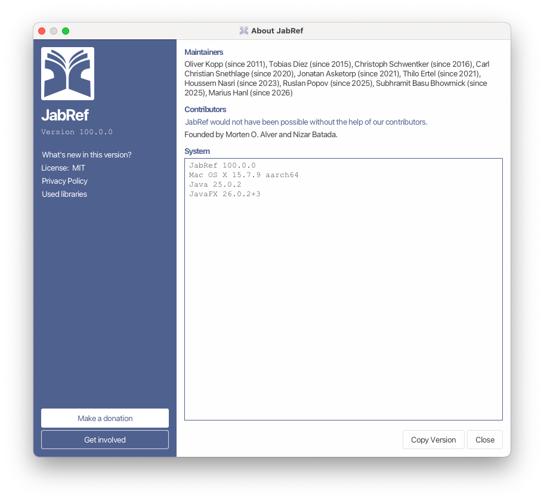
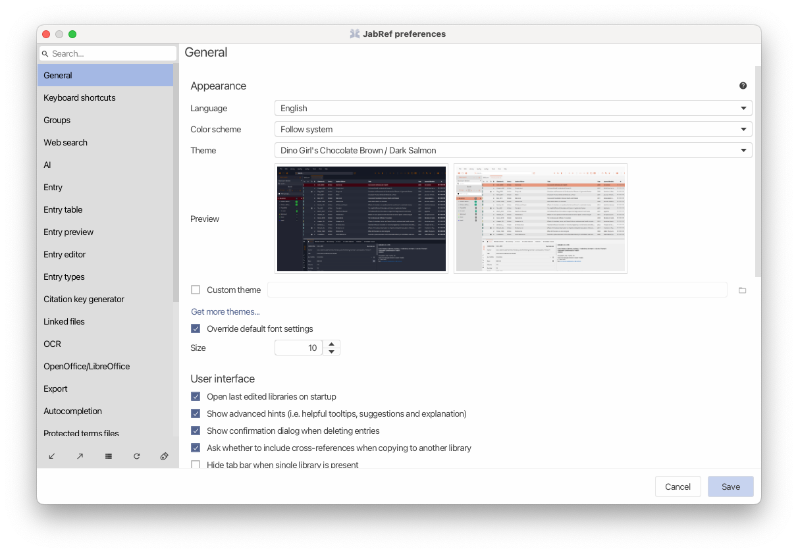
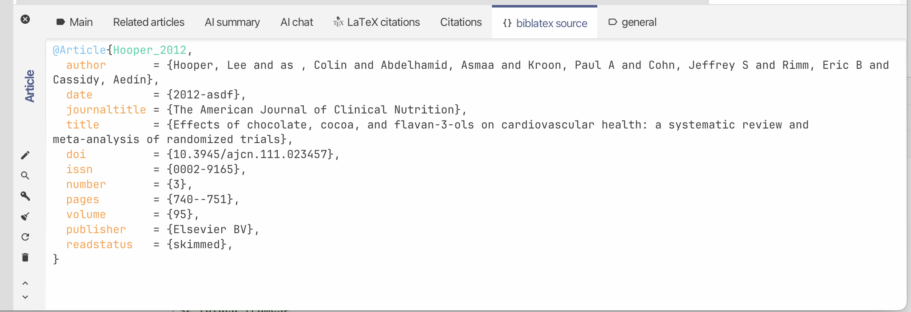
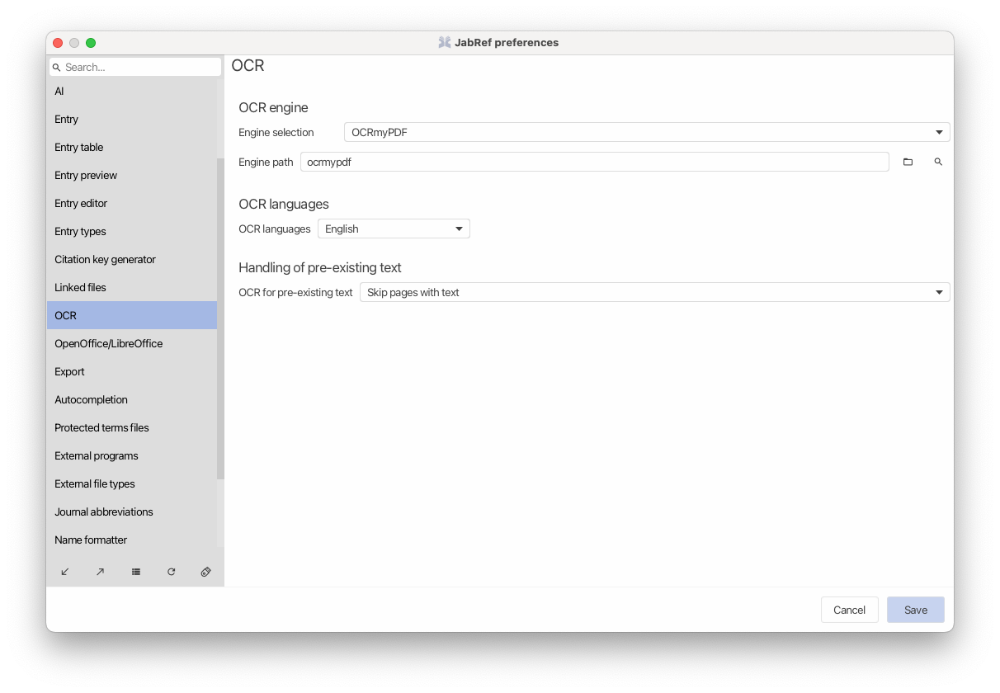
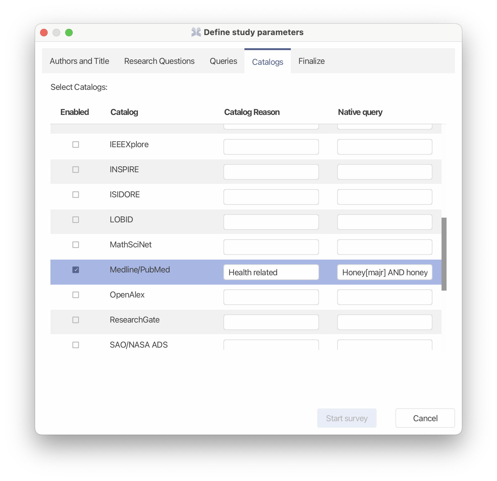

From Friday, September 4, to Thursday, September 10, 2026, the annual [JabCon](https://jabcon.jabref.org/) took place in Sindelfingen, Germany, where the majority of the JabRef maintainers, members, and friends of our non-profit organization JabRef e.V. met in person and worked together to improve JabRef and discuss the roadmap for future releases.

We are happy to announce the release of JabRef 6.0-beta, which includes several new features and improvements, and we now also celebrate 1,000 contributors and more than 4,700 stars on GitHub. 🎉

This year we focused on preparing the 6.0-beta release and fixing release-critical issues. As you can see in our JabCon dashboard, we achieved significant progress in these areas.

# Key Highlights

## Revamped Entry Editor

We revamped the entry editor to provide a more intuitive and user-friendly interface, especially the Main tab

The new unified “Main” tab brings an entry’s fields, files, identifiers, comments, and metadata into one streamlined view—alongside faster ways to add entries from URLs and navigate directly to fields.

## Improved Library Management and Collaboration

The revamped shared database feature with PostgreSQL now allows a smoother collaboration and synchronization of bibliographic data across multiple users and devices. However, as currently, only PostgreSQL supports a push-based system, we dropped support for mySQL as this would have made the synchronization harder.

For a while the JabRef 6.0 alphas shipped with experimental git support as a use case for collaboration and version control.
In this new beta version the git support becomes more practical with semantic diffs, one-click commit-and-push, automatic Git actions, and safer commits.

## New Theming System

We have introduced a new theming system that allows users to customize the look and feel of JabRef to their liking. This system provides a wide range of options for colors, fonts, and other visual elements, making JabRef more visually appealing and easier to use.

This also led to the overhaul of the "About JabRef" dialog, which changed a couple of times over the 20 years of JabRef. We now acknowledge again the founders of JabRef as without them, we would not be here today releasing a new version!

A while ago the user Dino Girl spent some great effort in creating some fancy-colored themes for JabRef, and we honor their work by shipping them now with JabRef.
With the new theming system you can now independently change the color scheme of the theme as well.

And the BibTeX editor now gained proper syntax highlighting, making it easier to read and edit complex BibTeX entries.

Check out [custom-theme page repo](https://themes.jabref.org/) for a gallery of themes and updates to existing themes.

## Performance Improvements

Over the last months we measured and successfully improved the performance of JabRef, especially when dealing with large libraries and many groups. This also applies to the startup of JabRef and also has a positive impact of the shared database feature, making collaboration now even smoother.

## GSoC

The [Google Summer of Code (GSoC)](https://summerofcode.withgoogle.com/) program has been a great success for JabRef, with several students contributing valuable features and improvements to the software.

### LibreOffice Improvements and Zotero Compatibility

This year's GSOC project by [Hancong](https://github.com/pluto-han) focused on improving JabRef's compatibility with LibreOffice and Zotero, and these changes ship together with other improvements.

Major improvements include Zotero-compatible CSL citations, Track Changes support, .bst bibliography generation, richer “Cite special” options, and more reliable citation formatting and ordering.

LaTeX users might also appreciate the new bst-Style support. For a while JabRef could already parse and render `.bst` (BibTeX-Style) files, allowing users to have previews that resemble the output of the rendered bibliography in their LaTeX document. These .bst Styles can now also be used in LibreOffice, providing the same style as in your LaTeX document.

### OCR Integration

Frequent blog post readers will already know that this release includes a new OCR feature which was a GSoC project by [Zeyad](https://github.com/ZiadAbdElFatah).

The OCR feature allows using an external OCR tool to extract fulltext from scanned PDFs. Currently, we support [DocLing](https://docling-project.github.io/docling) and [ocrMyPdf](https://github.com/ocrmypdf/ocrmypdf).

Once the fulltext is extracted, it is then added to JabRef's fulltext indexer and available in JabRef's fulltext search as well.

### SLR, Fetcher, and Importer improvements

This summer we also had a team of students working on improving JabRef's support for systematic literature reviews (SLRs) and fetchers. Their work has greatly improved JabRef's ability to retrieve and manage bibliographic data.
One of the new features is the possibility to define native queries for SLRs. For more details refer to the blog post [Systematic Literature Reviews in JabRef](https://blog.jabref.org/2026/08/01/systematic-literature-reviews-in-jabref/)

During the work on SLR, the fetchers in JabRef were also improved and new fetchers were added, for example, [BieleFeld Academic Search Engine](https://base-search.net/) and [German Natinal Bibliography](https://dnb.de). The latter one is also used as a source for ISBN lookup.
JabRef now also can import and export the [Hayagriva](https://github.com/typst/hayagriva) file format from the Typst bibliography manager. In addition, there is now also a generic CSV exporter that simply exports all fields and content of a BibEntry to a CSV file.

## Undo-Redo Unification

As a user you expect undo and redo to work out of the box and do not usually think about it. However, in JabRef we sound some related issues to this which degraded the user experience. Over the last months we worked hard to unify the Undo and Redo implementations and fix bugs along the way to ensure a smoother user experience.

## JavaFX improvements

A more technical detail, but JabRef uses [JavaFX](https://openjfx.io/) for its user interface, and during the JabCon, [Marius Hanl](https://github.com/maran23) worked on improving the theming system in JabRef and fixed bugs in the JavaFX framework that were discovered by the JabRef team over the last years.
The changes in JavaFX will benefit all developers and improve the future user experience of JavaFX-based applications.

## Special Thanks

We want to thank all the users who are constantly testing the latest snapshots and providing feedback!
Furthermore, we would like to thank our [donators](https://donations.jabref.org) and JabRef e.V. members who made it possible for many JabRef developers to attend the conference and to support our work.
In case you like to donate money regularly, we would prefer via our bank account (tax-deductible and no fees) or via GitHub Sponsors as the fees are lower than PayPal.
Of course, we also want to thank Google for providing the opportunity for JabRef to participate in GSoC.

We would like to thank all the students who participated in GSoC and made JabRef a better tool for everyone.
Even more impressive is that participants took on the odyssey with Deutsche Bahn and traveled to JabCon 2026 from the Netherlands and Switzerland. They all arrived safely...;)

We are excited for next year's JabCon, GSoC (if we get accepted again) and will be heading to the next JabRef release!

### Collaborations

As you might have noticed as a contributor, since a while we have officially collaborated with [Apidia](https://apidia.net/) which provides a unique way to browse Javadoc of JabRef and its dependencies.
